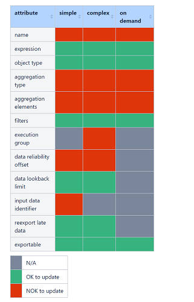

# PM Stats Calculator Application Developers Guide

- [PM Stats Calculator Application Developers Guide](#pm-stats-calculator-application-developers-guide)
  - [Introduction](#introduction)
    - [Revision History](#revision-history)
  - [General Workflow](#general-workflow)
    - [KPI Definitions](#kpi-definitions)
    - [Scheduling of the Calculations](#scheduling-of-the-calculations)
      - [On Demand calculations](#on-demand-calculations)
      - [Scheduled calculations](#scheduling-of-the-calculations)
    - [Kafka Usage](#kafka-usage)
    - [Execution Report](#execution-report)
      - [Reliability Threshold](#reliability-threshold)
  - [Interfaces](#interfaces)
    - [Calculations endpoint](#calculations-endpoint)
      - [Nothing Calculated Status](#nothing-calculated-status)
    - [KPI Definitions endpoints](#kpi-definitions-endpoints)
      - [Post endpoint](#post-endpoint--modelv1definitions-)
      - [Patch endpoint](#patch-endpoint--modelv1definitionskpiname-)
      - [Get endpoint](#get-endpoint--modelv1definitions-)
      - [Delete endpoint](#delete-endpoint--modelv1definitions-)
      - [Put endpoint](#put-endpoint--modelv1definitions-)
    - [UDF and UDAF functions](#udf-and-udaf-functions)
      - [List of User Defined Functions](#list-of-user-defined-functions)
        - [Array manipulation](#array-manipulation)
          - [Appending arrays](#appending-arrays)
          - [Appending arrays given cardinality and limit](#appending-arrays-given-cardinality-and-limit)
          - [Adding values to an array with limit](#adding-values-to-an-array-with-limit)
        - [Median](#median)
        - [Percentile calculations](#percentile-calculations)
          - [Percentile value](#percentile-value)
          - [Percentile bin](#percentile-bin)
        - [FDN parsing](#fdn-parsing)
        - [Truncate To Fifteen Minute](#truncate-to-fifteen-minute)
        - [Update Null Time Advanced Kpis](#update-null-time-advanced-kpis)
      - [List of User Defined Aggregate Functions](#list-of-user-defined-aggregate-functions)
        - [Array index sum](#array-index-sum)
        - [Percentile](#percentile)
  - [Integration](#integration)
  - [Testing](#testing)
  - [Limitations](#limitations)
    - [Schema Namespace](#schema-namespace)
  - [Metrics](#metrics)
    - [Java Virtual Machine (JVM) metrics](#java-virtual-machine-jvm-metrics)
    - [Apache Spark metrics](#apache-spark-metrics)
    - [Java EE metrics](#java-ee-metrics)
    - [Kafka Producer metrics](#kafka-producer-metrics)
  - [References](#references)

## Introduction

This document provides guidelines for how to use the
PM Stats Calculator Service from an application developer’s point of view.
It gives a brief description of its main features and its interfaces.

The PM Stats Calculator is responsible to read the raw data in the form of PM counters in Avro records of Managed Objects for the
Key Performance Indicators (KPIs for short) from Kafka, execute calculations on them, save the results into the internal Postgres DB,
and write a report about it to Kafka.

### Revision History

| Date       | Revision | Comment                                               | Author  |
|------------|----------|-------------------------------------------------------|---------|
| 2023-01-30 | 1.0.0    | First revision                                        | EEADHRV |
| 2023-03-03 | 1.1.0    | Adding new KPI model information                      | EHUCADA |
| 2023-03-20 | 1.1.1    | Changing input data identifier structure              | EEADHRV |
| 2023-05-25 | 1.2.0    | Including On Demand Parameters and Tabular Parameters | EGADNNA |
| 2023-06-05 | 1.3.0    | Adding the UDF and UDAF descriptions                  | EVAMOLN |
| 2023-06-19 | 1.4.0    | Adding CRUD API documentation.                        | EAJTALE |
| 2023-06-19 | 1.4.1    | Minor changes in validation information.              | EHUCADA |
| 2023-12-06 | 1.4.2    | Minor changes in UDF and UDAF functions.              | ENEMZOL |
| 2024-01-17 | 1.5.0    | Adding information on metrics.                        | EHUCADA |
| 2024-02-13 | 1.6.0    | Dimension enrichment                                  | EPICESZ |

## General Workflow

The chapter below gives a general understanding about how the calculator works, and some explanation for the different parts
of the flow.

### KPI Definitions

KPI definition has 3 types:

- Scheduled Simple
- Scheduled Complex
- On Demand

The first two, as the name states, are calculated periodically, with a time interval that can be configured in the values.yaml
under `kpiExecutionPeriod`. The primary distinction of the two is the location of the source data.
Simples are getting the data to calculate from Kafka, while the Complexes are getting it from the internal database.
On Demands will get its source data from the internal database but will only be calculated right after a calculation triggered on the REST API.
On Demand calculations can be enriched with external data using tabular parameters. The value of the tabular parameters are sent in REST requests
when triggering the calculation.

The table below contains the attributes that can be set for a definition. Note that not all attributes are required for the different KPI definition types.

| Attribute name          | Description                                                                                                                                                                                                       | Default value  |
|-------------------------|-------------------------------------------------------------------------------------------------------------------------------------------------------------------------------------------------------------------|----------------|
| Name                    | The name of the KPI, must be unique.                                                                                                                                                                              | -              |
| Alias                   | Has a purpose during output table creation. The table will be named `kpi_<alias>_<agg_period>`                                                                                                                    | -              |
| Expression              | This attribute will be the decider how the KPI is calculated. It has an SQL like syntax.                                                                                                                          | -              |
| Object type             | The type of the KPI after calculation. (ex.: INTEGER, LONG, etc.)                                                                                                                                                 | -              |
| Aggregation type        | The type of the calculation. (ex.: SUM, MAX, etc.)                                                                                                                                                                | -              |
| Aggregation period      | The period for which the KPI is calculated. The value is in minutes (values can be 15, 60, 1440). If left blank, aggregation will run all the input data. Inside the code and logs, blank value is managed as -1. | no aggregation |
| Aggregation elements    | List of elements the KPI will be grouped by during calculation.                                                                                                                                                   | -              |
| Execution group         | All KPI in the same execution group will be calculated together. Defining is only relevant for `COMPLEX` KPIs.                                                                                                    | ""             |
| Exportable              | An attribute which is needed later on to know if we want to expose the KPI or not.                                                                                                                                | false          |
| Filters                 | Filtering out the data relevant for the KPI                                                                                                                                                                       | empty array    |
| Data reliability offset | This attribute determines when we will say a data is reliable. (ex.: with a value of -10 the 9:00 reliability means we processed every data until 8:50)                                                           | 15             |
| Data lookback limit     | Determines how old can the data be, related to the previous calculation to include it in the next calculation                                                                                                     | 7200           |
| Input data identifier   | This attribute is needed to retrieve data form the Data Catalog for the source data. The structure is: `<DataSpace>&#124;<DataCategory>&#124;<SchemaName>`                                                        | null           |
| Reexport late data      | This is relevant only for the export of the KPI. If the KPI was exported rather or not to export it again when late data arrives.                                                                                 | false          |

KPI definitions must be sent to the REST endpoint in JSON format (see details [here](#kpi-definitions-endpoints)).

### Scheduling of the Calculations

The scheduling of the scheduled KPIs happens periodically with the already mentioned `kpiExecutionPeriod` value,
while the On Demand calculation starts immediately if its possible, after a submission through the REST API.
The default value for parallel calculations is 2, this means, that every given time there can be 2 running calculations.
While this value can be changed deployment time with the `maximumConcurrentCalculations` property, it is not recommended as the resource
needs for Spark also needs to be defined.

The KPIs logically belonging together are grouped in an Execution group, which means these KPIs will be calculated in a single calculation.
The manner of grouping is different for each KPI type. For Complex KPIs, execution groups are defined explicitly in the KPI definition.
For On Demands, grouping is determined by the trigger request, KPIs which are triggered in the same request are calculated together in one execution
group, for the Simple KPIs there is an internal logic which also can be configured in the values.yaml:

~~~yaml
groupingRules:
  inputSource: true
  aggregationPeriod: false
  aggregationElements: false
~~~

Above the default values can be seen. Setting the `inputSource` flag to true at deployment time will group all Simple KPI definitions with identical
`inp_data_identifier` values into a single calculation. Setting only the `aggregationPeriod` to true will mean every Simple KPI with the same
aggregation period will be calculated together. Setting only the `aggregationElements` will result in calculating every Simple KPI which has the same
aggregation elements together. These flags are not exclusive, they can be mixed as preferred, resulting in all the rules applying to group the
KPIs together.

#### On Demand calculations

The maximum number of queueing (either waiting or calculating state) On Demand calculations can not exceed the default threshold of 5
at any given time, if a new request tries to do so an error message of `PM Stats Calculator is currently handling the maximum number of calculations`
can be seen in the REST response. This value can be changed with the `maxNumberOfParallelOnDemandCalculations` parameter.

While the On Demand calculations are prioritized, to not get into a problem where only On Demand calculations are running and no scheduled can have a
time slot, a `queueWeight` parameter is set for simple and On Demand, and every time an On Demand is polled from the queue the counter will decrease,
until the counter reaches 0. When this happens a Simple calculation will be polled even if there is an On Demand waiting,
and resets the counter to the defined value.

#### Scheduled calculations

Every heartbeat (the CRON expression defined in the `kpiExecutionPeriod`) will start a new round of scheduled calculations.

> **_NOTE:_** The default value of the `kpiExecutionPeriod` is `0 0-53/7 * * * ? *` which means there are calculations in the minutes of the hour
> which is divisible by 7, up until minute 53 of the hour. So calculations happen every hour at 0,7,14,...42,49.
> 56 is skipped to have enough time between the last and the next calculation

The Simple execution groups will be put in the queue first, after that the following 2 checks will happen for the Complex KPIs.

- All the execution groups are queued in a way that dependencies are taken into consideration.

> **_EXAMPLE:_** Group A depends on Group B, Group C depends on Group A will result in a queue of: B,A,C

- All Groups will be checked if there was new data since the last run. We calculate the group if there is at least one KPI that can be
  reliably calculated. If there is none the Group will be taken out from the calculation queue. For more detail on [Reliability](#reliability-threshold)
  please refer to its section.

> **_NOTE:_** Due to the fact that complexes can depend on another complex group, to not calculate before a dependent group isn't calculated, only 1
> calculation can run simultaneously

It is a possible scenario that not all Complex calculations are completed before the start of the next heartbeat. In order to ensure that all Complex
execution groups are calculated, no new Simple calculations will be added to the queue as long as there are any Complex calculations in the queue.
As a consequence, there exists a failsafe mechanism which enforces the calculation of Simple execution groups after a given time, to ensure that no
data is lost from Kafka. This introduces a new parameter `maxHeartbeatToWaitToRecalculateSimples` (default 5), if no Simple Calculation were done in
the last X (where X is the value of the property) heartbeat, because of Complex calculations, the Complex queue will be cleared, and Simples will be
queued again.

### Kafka usage

The source data for Simple Calculations are located in Kafka in Avro format. The Schema for the data shall be saved into the Schema Registry
with Record Name Strategy for the PM Stats Calculator to be able to find the schemas properly.
In the definition of Simple KPIs the `inp_data_identifier` field contains all the needed information to obtain the Kafka topic and address
from the Data Catalog. Before submitting a KPI definition it has to be ensured that the schema and its details (the address of th Kafka instance, and
the topic, where the data will be located) are registered into the Schema Registry and Data Catalog, or the validation of the definition will fail.
To not overload the Spark the maximum number of message can be set in the values.yaml under `kafka.bucketSize` this parameter will limit the number of
read messages in a single calculation.

One more important thing is need to be mentioned: Reading from kafka only messages which has the name of the schema inside the header will be included
in the calculation. A message without the correct schema name in the message header will be disregarded.

> **_REMINDER:_** the `inp_data_identifier` looks like this: `category|schemaName` has the information to find the topic and Kafka address from the
> Data Catalog

### Execution Report

At the end of each successful calculation a report will be made about the calculation and will be sent to Kafka in a JSON format. The main purpose of
this report is to serve as an input for the PM Stats Exporter, it is not intended to be exposed outside the PM Stats Calculation Handling application

An example look of the report can be seen here:

~~~json
{
  "execution_id": "0e79daa6-16f4-46f3-960d-91a6656e8f1b",
  "scheduled": true,
  "execution_start": 1675096080,
  "execution_end": 1675096150,
  "execution_group": "group",
  "tables": [
    {
      "name": "kpi_simple_60",
      "aggregation_period": 60,
      "kpis": [
        {
          "name": "kpi1",
          "reexport_late_data": false,
          "exportable": true,
          "reliability_threshold": 1674968400,
          "calculation_start_time": 1674961200
        },
        {
          "name": "kpi2",
          "reexport_late_data": false,
          "exportable": true,
          "reliability_threshold": 1674968400,
          "calculation_start_time": 1674961200
        }
      ],
      "list_of_kpis": [
        "kpi1",
        "kpi2"
      ],
      "list_of_dimensions": [
        "agg_element_0",
        "agg_element_1",
        "aggregation_begin_time",
        "aggregation_end_time"
      ]
    }
  ]
}
~~~

As it can be seen the report contains basic information about the calculation itself, such as, the calculation's UUID,
the start and end time of the calculation, the type of it (scheduled or not) and the group what was calculated.
The inside of the report is all related to the output tables which were calculated in this execution. Each table will have its own section which will
specify the dimensions and KPIs of said table, and some more information about the calculated KPIs.

A closer look on the data about a single KPI:

~~~json
{
  "name": "kpi1",
  "reexport_late_data": false,
  "exportable": true,
  "reliability_threshold": 1674968400,
  "calculation_start_time": 1674961200
}
~~~

The `name`, `reexport_late_data` and `exportable` fields can be found in the KPI definitions itself, and mean the same here.
There are 2 new field which needs more information. One is `calculation_start_time` which states the earliest timestamp of the source data used in the
calculation of the KPI. The other one is `reliability_threshold`.

#### Reliability Threshold

At the KPI definitions the field `data_reliability_offset` was a plus information till when we say a KPI is reliable.

> **_REMINDER:_** If the `data_reliability_offset` is 15 when there is data after 10:16 we will say the `reliability_threshold` is 10:00

Calculating this value is dependent on the type, for Simple KPIs after each calculation there will be a readiness log which contains the
earliest and latest data received, from these data a mathematical calculation determines the reliability, considering the aggregation period.
For On Demand KPIs the reliability threshold is written during calculation and specifies what was the latest time till the data was calculated.
Complex KPI calculation limits are calculated from the Simple Readiness logs. The start time will be the lowest data that wasn't calculated yet,
considering the `data_lookback_limit`, the end time will be the lowest common latest collected data considering the `data_reliability_offset`, meaning
the `reliability_threshold` will be the same as for an On Demand: the end time of the calculation.

Examples for better understanding:

| Calculation type                    | Source Data  | Data Reliability offset | Calculation between | Reliability threshold |
|-------------------------------------|--------------|-------------------------|---------------------|-----------------------|
| Simple                              | 9:45 - 10:00 | 0                       | 9:00 - 10:00        | 10:00                 |
| Simple                              | 8:45 - 10:00 | 15                      | 8:00 - 10:00        | 9:00                  |
| Simple                              | 8:30 - 9:45  | -15                     | 8:00 - 10:00        | 10:00                 |
| On Demand                           | 9:00 - 10:00 | -                       | 9:00 - 10:00        | 10:00                 |
| Complex (without previous)          | 9:00 - 10:00 | 10                      | 9:00 - 10:00        | 10:00                 |
| Complex (with previous ended 12:00) | 9:00 - 10:00 | -15                     | 9:00 - 12:00        | 12:00                 |

> **_NOTE:_** The Complex calculations use the reliability offset during the determination of the calculation time, hence the calculation end time
> will be the reliability threshold.

## Interfaces

The service exposes 2 REST endpoints, 1 is for registering the KPI definitions, and the other is for information about the calculations or trigger an
On Demand calculation. Full REST API documentation can be found [here][REST]

### Calculations endpoint

URL: `http://eric-pm-stats-calculator:8080/kpi-handling/calc/v1/calculations`

With a POST request an On Demand calculation can be triggered. In the body, a source identifier, the name of the KPIs must be specified,
while the used parameters and tabular parameters are optional fields, which only needed if any of the KPI requires it.

An example body:

~~~json
{
  "source": "TEST",
  "kpi_names": [
    "kpi1",
    "kpi2",
    "kpi3",
    "kpi4"
  ],
  "parameters": [
    {
      "name": "param.execution_id",
      "value": "TEST_1"
    },
    {
      "name": "param.date_for_filter",
      "value": "2023-06-06"
    }
  ],
  "tabular_parameters": [
    {
      "name": "cell_configuration",
      "format": "CSV",
      "header": "fdn,target_throughput_r,min_rops_for_app_cov_reliability",
      "value": "FDN1,0.3,12\nFDN2,0.8,21"
    }
  ]
}
~~~

A successful trigger will look like this:
~~~json
{
    "successMessage": "Requested KPIs are valid and calculation has been launched",
    "calculationId": "9fbeabad-3a1b-437c-81c3-0a5e5a1cab43",
    "kpiOutputLocations": {
        "kpi1": "kpi_cell_guid_60",
        "kpi2": "kpi_cell_guid_60",
        "kpi3": "kpi_cell_guid_60",
        "kpi4": "kpi_cell_guid_60"
    }
}
~~~

An unsuccessful request will describe the error, like the already mentioned too many On Demand in the queue message.

The endpoint can also serve as an information gathering for the calculations, the same URL with a GET request will list all the calculation UUIDs
which were done in the previous 60 minutes, which can be configured with the `elapsedMinutes` query parameter like this:
`http://eric-pm-stats-calculator:8080/kpi-handling/calc/v1/calculations?elapsedMinutes=240` this request will give back the calculations from the
last 4 hours.

There is a way to gather more information from a single calculation, when we give the UUID to the endpoint like so:
`http://eric-pm-stats-calculator:8080/kpi-handling/calc/v1/calculations/9fbeabad-3a1b-437c-81c3-0a5e5a1cab43`

The answer will tell what is the status of the Calculation, and if it is in a Successful stage will also gather information about what Readiness logs
were used for the calculation, if it is applicable. For Simple and Complex calculations the readiness logs contains all the used source data
information, while the On Demand calculations can't be tied to readiness logs, so that field is empty.

The possible outcome for a successful message by KPI type:

Simple:

~~~json
{
  "calculationId": "4ab4d691-caff-4030-8f5f-72879b7311f7",
  "status": "FINISHED",
  "executionGroup": "category|schema",
  "readinessLogs": [
    {
      "collectedRowsCount": 41,
      "datasource": "category|schema",
      "earliestCollectedData": "2023-01-28T14:00:00",
      "latestCollectedData": "2023-01-29T07:00:00"
    }
  ]
}
~~~

Complex:

~~~json
{
    "calculationId": "3326626a-5774-46d9-86a3-a846193690cc",
    "status": "FINISHED",
    "executionGroup": "COMPLEX4",
    "readinessLogs": [
        {
            "collectedRowsCount": 3,
            "datasource": "category|schema",
            "earliestCollectedData": "2023-01-29T03:00:00",
            "latestCollectedData": "2023-01-29T05:00:00"
        },
        {
            "collectedRowsCount": 154,
            "datasource": "category|schema2",
            "earliestCollectedData": "2023-01-28T15:00:00",
            "latestCollectedData": "2023-01-29T02:00:00"
        },
        {
            "collectedRowsCount": 156,
            "datasource": "category|schema0",
            "earliestCollectedData": "2023-01-28T15:00:00",
            "latestCollectedData": "2023-01-29T02:00:00"
        }
    ]
}
~~~

On Demand:

~~~json
{
    "calculationId": "9fbeabad-3a1b-437c-81c3-0a5e5a1cab43",
    "status": "FINISHED",
    "executionGroup": "ON_DEMAND",
    "readinessLogs": []
}
~~~

#### Nothing Calculated Status

If there is no new messages on the Kafka topic, or no readiness log has been persisted for the ***simple calculation*** the request response will
have the `NOTHING_CALCULATED` status.

### KPI Definitions endpoints

Validations are performed for all endpoints by the application on the incoming KPI definition data.
Details about the validations are listed in the code repository in a separate file (validation-rules.md).

#### Post endpoint ( /model/v1/definitions )

This endpoint gives the ability to insert new KPI definitions into the database.

The request body must contain the KPI definitions to be added. Details about the available fields are listed [here](#kpi-definitions).

The request body JSON has a hierarchical structure. The following rules apply:

- KPI definitions must be grouped by KPI type ("scheduled_simple", "scheduled_complex" or "on_demand"). The KPI types are the top level JSON objects.
- Every KPI type contains KPI output table objects ("kpi_output_tables"). Tables are uniquely identified by the aggregation period and the alias attributes.
- KPI definitions are added to each respective table ("kpi_definitions").
- Both the tables and the definitions have certain attributes assigned.

  A table-level attribute applies to all KPIs listed in the table (unless overridden at definition level, see next point).

- Certain attributes are possible to set both at table and at definition level.

  If the attribute is set both at table and at definition level, the definition-level setting overrides the table-level setting.
  For example, you can set exportable=false for a table in general, and set exportable=true for a small number of KPIs you want to export.

- Certain attributes are optional both at table and at definition level, meaning they can be omitted completely.

  These attributes have global default values (see [here](#kpi-definitions))

An example request towards the endpoint:

~~~json
{
  "scheduled_simple": {
    "kpi_output_tables": [
      {
        "aggregation_period": 1440,
        "alias": "cell_guid_simple",
        "aggregation_elements": [
          "new_fact_table_0.nodeFDN"
        ],
        "exportable": true,
        "data_reliability_offset": 0,
        "inp_data_identifier": "dataSpace|category|new_fact_table_0",
        "kpi_definitions": [
          {
            "name": "sum_integer_1440_simple",
            "expression": "SUM(new_fact_table_0.pmCounters.integerColumn0)",
            "object_type": "INTEGER",
            "aggregation_type": "SUM"
          }
        ]
      }
    ]
  },
  "scheduled_complex": {
    "kpi_output_tables": [
      {
        "aggregation_period": 1440,
        "alias": "complex",
        "aggregation_elements": [
          "kpi_cell_guid_simple_1440.nodeFDN AS agg_column_0"
        ],
        "exportable": true,
        "data_reliability_offset": 0,
        "kpi_definitions": [
          {
            "name": "sum_integer_1440_complex",
            "expression": "SUM(sum_Integer_1440_simple.cell_guid_simple) FROM kpi_db://kpi_cell_guid_simple_1440",
            "object_type": "INTEGER",
            "aggregation_type": "SUM",
            "execution_group": "COMPLEX1"
          }
        ]
      }
    ]
  },
  "on_demand": {
    "parameters": [
      {"name":  "execution_id", "type": "STRING"}
    ],
    "tabular_parameters" : [
      {
        "name" : "cell_configuration",
        "columns" : [
          {"name": "target_throughput_r", "type": "FLOAT"},
          {"name": "min_rops_for_reliability", "type": "INTEGER"}
        ]
      }
    ],
    "kpi_output_tables": [
      {
        "aggregation_period": 1440,
        "alias": "rolling_aggregation",
        "aggregation_elements": [
          "kpi_cell_guid_simple_1440.nodeFDN AS agg_column_0"
        ],
        "exportable": false,
        "kpi_definitions": [
          {
            "name": "rolling_sum_integer_1440",
            "expression": "SUM(kpi_cell_guid_simple_1440.sum_Integer_1440_simple) FROM kpi_db://kpi_cell_guid_simple_1440",
            "object_type": "INTEGER",
            "aggregation_type": "SUM",
            "exportable": true
          }
        ]
      }
    ]
  }
}
~~~

The response contains whether the KPI definitions were accepted and the persisting of them was successful or not.
For exact details of the messages see the OpenAPI specification.
An example of a successful response:

~~~json
{
  "successMessage": "All KPIs proposed are validated and persisted to database",
  "submittedKpiDefinitions": {
    "sum_integer_1440_complex": "kpi_complex_1440",
    "rolling_sum_integer_1440": "kpi_rolling_aggregation_1440",
    "sum_integer_1440_simple": "kpi_cell_guid_simple_1440"
  }
}
~~~

The below snippet contains the required / optional fields of the payload:

~~~json
{
  "on_demand": {
    "kpi_output_tables": [
      {
        "aggregation_period": "REQUIRED",
        "alias": "REQUIRED",
        "aggregation_elements": ["REQUIRED"],
        "exportable": "OPTIONAL",
        "kpi_definitions": [
          {
            "name": "REQUIRED",
            "expression": "REQUIRED",
            "object_type": "REQUIRED",
            "aggregation_type": "REQUIRED",
            "aggregation_elements": ["OPTIONAL"],
            "exportable": "OPTIONAL",
            "filters": ["OPTIONAL"]
          }
        ]
      }
    ]
  },
  "scheduled_complex": {
    "kpi_output_tables": [
      {
        "aggregation_period": "OPTIONAL",
        "alias": "REQUIRED",
        "aggregation_elements": ["REQUIRED"],
        "exportable": "OPTIONAL",
        "data_reliability_offset": "OPTIONAL",
        "data_lookback_limit": "OPTIONAL",
        "reexport_late_data": "OPTIONAL",
        "kpi_definitions": [
          {
            "name": "REQUIRED",
            "expression": "REQUIRED",
            "object_type": "REQUIRED",
            "aggregation_type": "REQUIRED",
            "execution_group": "REQUIRED",
            "aggregation_elements": ["OPTIONAL"],
            "exportable": "OPTIONAL",
            "filters": ["OPTIONAL"],
            "data_reliability_offset": "OPTIONAL",
            "data_lookback_limit": "OPTIONAL",
            "reexport_late_data": "OPTIONAL"
          }
        ]
      }
    ]
  },
  "scheduled_simple": {
    "kpi_output_tables": [
      {
        "aggregation_period": "OPTIONAL",
        "alias": "REQUIRED",
        "aggregation_elements": ["REQUIRED"],
        "exportable": "OPTIONAL",
        "inp_data_identifier": "REQUIRED",
        "data_reliability_offset": "OPTIONAL",
        "data_lookback_limit": "OPTIONAL",
        "reexport_late_data": "OPTIONAL",
        "kpi_definitions": [
          {
            "name": "REQUIRED",
            "expression": "REQUIRED",
            "object_type": "REQUIRED",
            "aggregation_type": "REQUIRED",
            "aggregation_elements": ["OPTIONAL"],
            "exportable": "OPTIONAL",
            "filters": ["OPTIONAL"],
            "data_reliability_offset": "OPTIONAL",
            "data_lookback_limit": "OPTIONAL",
            "reexport_late_data": "OPTIONAL",
            "inp_data_identifier": "OPTIONAL"
          }
        ]
      }
    ]
  }
}
~~~

The validation error message will specify the reason of the failure and the received attribute value.

#### Patch endpoint ( /model/v1/definitions/${kpi_name} )

This endpoint gives the ability to update one existing KPI definition in the database.
The endpoint accepts a single KPI definition request which is validated by
the currently existing validation process. All the fields in the request are optional which means any of them can be
omitted.

Here is an example request:

~~~json
{
  "expression": "SUM(kpi_cell_guid_simple_1440.sum_Integer_1440_simple) FROM kpi_db://kpi_cell_guid_simple_1440",
  "object_type": "INTEGER",
  "filters": [
    "agg_column_0 > 550"
  ],
  "data_lookback_limit": 180,
  "exportable": true,
  "reexport_late_data": true
}
~~~

The following picture shows which fields can or cannot be updated in the KPI definition.



The response contains the updated KPI Definition.

For exact details of the messages see the OpenAPI specification.
An example of a successful response:

~~~json
{
  "name" : "simple_one",
  "alias" : "alias_simple_table_one",
  "aggregation_period" : 60,
  "expression": "SUM(kpi_cell_guid_simple_1440.sum_Integer_1440_simple) FROM kpi_db://kpi_cell_guid_simple_1440",
  "object_type" : "INTEGER",
  "aggregation_type" : "SUM",
  "aggregation_elements" : [ "table.column1", "table.column2" ],
  "filters": [
    "agg_column_0 > 550"
  ],
  "data_reliability_offset" : 0,
  "data_lookback_limit": 180,
  "inp_data_identifier" : "dataSpace|category|schemaName",
  "reexport_late_data" : true,
  "exportable" : true
}
~~~

#### Get endpoint ( /model/v1/definitions )

This endpoint helps to retrieve the persisted KPI definitions from the database.

This endpoint has an optional query param: showDeleted. The default value is false. If showDeleted is true, the Get
endpoint will retrieve all the KPIs including the deleted ones.

The response contains the retrieved KPI definitions, or an error message in case of failure.

For exact details of the messages see the OpenAPI specification.
Here is an example response message from the endpoint:

~~~json
{
  "scheduled_simple": {
    "kpi_output_tables": [
      {
        "alias": "simple",
        "aggregation_period": 60,
        "kpi_definitions": [
          {
            "name": "integer_simple",
            "expression": "FIRST(a_new_very_simple_kpi.pmCounters.integerColumn0)",
            "object_type": "INTEGER",
            "aggregation_type": "FIRST",
            "aggregation_elements": [
              "a_new_very_simple_kpi.agg_column_0",
              "a_new_very_simple_kpi.agg_column_1"
            ],
            "exportable": true,
            "filters": [],
            "reexport_late_data": false,
            "data_reliability_offset": 0,
            "data_lookback_limit": 180,
            "inp_data_identifier": "dataSpace|category|a_new_very_simple_kpi"
          }
        ]
      }
    ]
  },
  "scheduled_complex": {
    "kpi_output_tables": [
      {
        "alias": "complex",
        "aggregation_period": 60,
        "kpi_definitions": [
          {
            "name": "sum_integer_60_complex",
            "expression": "SUM(kpi_simple_60.integer_simple) FROM kpi_db://kpi_simple_60",
            "object_type": "INTEGER",
            "aggregation_type": "SUM",
            "aggregation_elements": [
              "kpi_simple_60.agg_column_0",
              "kpi_simple_60.agg_column_1"
            ],
            "exportable": true,
            "filters": [],
            "reexport_late_data": false,
            "data_reliability_offset": 0,
            "data_lookback_limit": 7200,
            "execution_group": "COMPLEX1"
          },
          {
            "name": "sum_float_60_complex",
            "expression": "SUM(kpi_simple_60.float_simple) FROM kpi_db://kpi_simple_60",
            "object_type": "FLOAT",
            "aggregation_type": "SUM",
            "aggregation_elements": [
              "kpi_simple_60.agg_column_0",
              "kpi_simple_60.agg_column_1"
            ],
            "exportable": true,
            "filters": [],
            "reexport_late_data": false,
            "data_reliability_offset": 0,
            "data_lookback_limit": 7200,
            "execution_group": "COMPLEX1"
          }
        ]
      }
    ]
  },
  "on_demand": {
    "kpi_output_tables": [
      {
        "alias": "rolling_aggregation",
        "aggregation_period": 1440,
        "kpi_definitions": [
          {
            "name": "rolling_sum_integer_1440",
            "expression": "SUM(kpi_cell_guid_simple_1440.sum_Integer_1440_simple) FROM kpi_db://kpi_cell_guid_simple_1440",
            "object_type": "INTEGER",
            "aggregation_type": "SUM",
            "aggregation_elements": [
              "kpi_cell_guid_simple_1440.nodeFDN AS agg_column_0"
            ],
            "exportable": true,
            "filters": []
          },
          {
            "name": "rolling_max_integer_1440",
            "expression": "MAX(kpi_cell_guid_simple_1440.sum_Integer_1440_simple) FROM kpi_db://kpi_cell_guid_simple_1440",
            "object_type": "INTEGER",
            "aggregation_type": "MAX",
            "aggregation_elements": [
              "kpi_cell_guid_simple_1440.nodeFDN AS agg_column_0"
            ],
            "exportable": false,
            "filters": []
          }
        ]
      }
    ]
  }
}
~~~

#### Delete endpoint ( /model/v1/definitions )

This endpoint gives the ability to delete a list of KPI definitions from the database.
This process also needs validation because if someone wants to delete a KPI definition
that is dependent on another KPI definition which is not in the list we want to delete,
then the KPI definition cannot be deleted.

Note: The results of the deleted KPIs are still available. However, the deleted KPIs are flagged as deleted,
meaning that while they won't be calculated nor exported anymore, the name of the KPIs cannot be used before the retention period is over.

The response contains the deleted KPI definitions, or a validation error message in case the deletion was not successful.

For exact details of the messages see the OpenAPI specification.

In the request, you must enlist the KPI Definitions you want to delete. For example:

~~~json
[
  "sum_integer_1440_complex",
  "rolling_sum_integer_1440",
  "sum_integer_1440_simple"
]
~~~

Here, the request was successful. So the response contains the deleted KPI definitions:

~~~json
[
  "sum_integer_1440_complex",
  "rolling_sum_integer_1440",
  "sum_integer_1440_simple"
]
~~~

#### Put endpoint ( /model/v1/definitions )

> **_WARNING:_** The KPI Definition PUT endpoint has been deprecated, and its use is not supported anymore.
> Its functionality is replaced by the KPI Definition POST and PATCH Endpoint

The KPI definition endpoint is responsible for validating and registering the submitted KPIs.

The request body must contain the KPI definitions to be added. Details about the available fields were listed at [here](#kpi-definitions).

The request body JSON has a hierarchical structure. The following rules apply:

- KPI definitions must be included grouped by KPI type ("scheduled_simple", "scheduled_complex" or "on_demand"). Top-level JSON objects are the KPI types.
- Every KPI type contains KPI output table objects ("kpi_output_tables"). Tables are uniquely identified by the aggregation period and the alias attributes.
- KPI definitions are added underneath each table ("kpi_definitions").
- On Demand and Scheduled Complex KPIs can be parameterized, but it has limitations:
    - In case of On Demand KPIs only the expression, the aggregation_elements and the filters are parameterizable
    - In case of Scheduled Complex KPIs only the expression and the filter are parameterizable, and
      only two value are accepted as parameter: ${param.start_date_time} and  ${param.end_date_time}.
- Tabular Parameters can only be added to On Demand requests.
- Both the tables and the definitions have certain attributes assigned.

  A table-level attribute applies to all KPIs listed in the table (unless overridden at definition level, see next point).

- Certain attributes are possible to set both at table and at definition level.

  If the attribute is set both at table and at definition level, the definition-level setting overrides the table-level setting.
  For example, you can set exportable=false for a table in general, and set exportable=true for a small number of KPIs you do want to export.

- Certain attributes are optional both at table and at definition level, meaning they can be omitted completely.

  These attributes have global default values (see at [here](#kpi-definitions))

An example request towards the endpoint:

~~~json
{
  "scheduled_simple": {
    "kpi_output_tables": [
      {
        "aggregation_period": 1440,
        "alias": "cell_guid_simple",
        "aggregation_elements": [
          "new_fact_table_0.nodeFDN"
        ],
        "exportable": true,
        "data_reliability_offset": 0,
        "inp_data_identifier": "category|new_fact_table_0",
        "kpi_definitions": [
          {
            "name": "sum_integer_1440_simple",
            "expression": "SUM(new_fact_table_0.pmCounters.integerColumn0)",
            "object_type": "INTEGER",
            "aggregation_type": "SUM"
          }
        ]
      }
    ]
  },
  "scheduled_complex": {
    "kpi_output_tables": [
      {
        "aggregation_period": 1440,
        "alias": "complex",
        "aggregation_elements": [
          "kpi_cell_guid_simple_1440.nodeFDN AS agg_column_0"
        ],
        "exportable": true,
        "data_reliability_offset": 0,
        "kpi_definitions": [
          {
            "name": "sum_integer_1440_complex",
            "expression": "COUNT(sum_Integer_1440_simple.cell_guid_simple) FROM kpi_db://kpi_cell_guid_simple_1440",
            "object_type": "INTEGER",
            "aggregation_type": "COUNT",
            "execution_group": "COMPLEX1"
          }
        ]
      }
    ]
  },
  "on_demand": {
    "parameters": [
      {"name":  "execution_id", "type": "STRING"}
    ],
    "tabular_parameters" : [
      {
        "name" : "cell_configuration",
        "columns" : [
          {"name": "target_throughput_r", "type": "FLOAT"},
          {"name": "min_rops_for_reliability", "type": "INTEGER"}
        ]
      }
    ],
    "kpi_output_tables": [
      {
        "aggregation_period": 1440,
        "alias": "rolling_aggregation",
        "aggregation_elements": [
          "kpi_cell_guid_simple_1440.nodeFDN AS agg_column_0"
        ],
        "exportable": false,
        "kpi_definitions": [
          {
            "name": "rolling_sum_integer_1440",
            "expression": "SUM(kpi_cell_guid_simple_1440.sum_Integer_1440_simple) FROM kpi_db://kpi_cell_guid_simple_1440",
            "object_type": "INTEGER",
            "aggregation_type": "SUM",
            "exportable": true
          }
        ]
      }
    ]
  }
}
~~~

The response contains whether the KPI definitions were accepted and the persisting of them was successful or not.
For exact details of the messages see the OpenAPI specification.
An example successful response:

~~~json
{
  "successMessage": "All KPIs proposed are validated and persisted to database",
  "submittedKpiDefinitions": {
    "sum_integer_1440_complex": "kpi_complex_1440",
    "rolling_sum_integer_1440": "kpi_rolling_aggregation_1440",
    "sum_integer_1440_simple": "kpi_cell_guid_simple_1440"
  }
}
~~~

In the below snippet contains the required / optional fields of the payload:

~~~json
{
  "on_demand": {
    "parameters": ["OPTIONAL"],
    "tabular_parameters": ["OPTIONAL"],
    "kpi_output_tables": [
      {
        "aggregation_period": "REQUIRED",
        "alias": "REQUIRED",
        "aggregation_elements": ["REQUIRED"],
        "exportable": "OPTIONAL",
        "kpi_definitions": [
          {
            "name": "REQUIRED",
            "expression": "REQUIRED",
            "object_type": "REQUIRED",
            "aggregation_type": "REQUIRED",
            "aggregation_elements": ["OPTIONAL"],
            "exportable": "OPTIONAL",
            "filters": ["OPTIONAL"]
          }
        ]
      }
    ]
  },
  "scheduled_complex": {
    "kpi_output_tables": [
      {
        "aggregation_period": "OPTIONAL",
        "alias": "REQUIRED",
        "aggregation_elements": ["REQUIRED"],
        "exportable": "OPTIONAL",
        "data_reliability_offset": "OPTIONAL",
        "data_lookback_limit": "OPTIONAL",
        "reexport_late_data": "OPTIONAL",
        "kpi_definitions": [
          {
            "name": "REQUIRED",
            "expression": "REQUIRED",
            "object_type": "REQUIRED",
            "aggregation_type": "REQUIRED",
            "execution_group": "REQUIRED",
            "aggregation_elements": ["OPTIONAL"],
            "exportable": "OPTIONAL",
            "filters": ["OPTIONAL"],
            "data_reliability_offset": "OPTIONAL",
            "data_lookback_limit": "OPTIONAL",
            "reexport_late_data": "OPTIONAL"
          }
        ]
      }
    ]
  },
  "scheduled_simple": {
    "kpi_output_tables": [
      {
        "aggregation_period": "OPTIONAL",
        "alias": "REQUIRED",
        "aggregation_elements": ["REQUIRED"],
        "exportable": "OPTIONAL",
        "inp_data_identifier": "REQUIRED",
        "data_reliability_offset": "OPTIONAL",
        "data_lookback_limit": "OPTIONAL",
        "reexport_late_data": "OPTIONAL",
        "kpi_definitions": [
          {
            "name": "REQUIRED",
            "expression": "REQUIRED",
            "object_type": "REQUIRED",
            "aggregation_type": "REQUIRED",
            "aggregation_elements": ["OPTIONAL"],
            "exportable": "OPTIONAL",
            "filters": ["OPTIONAL"],
            "data_reliability_offset": "OPTIONAL",
            "data_lookback_limit": "OPTIONAL",
            "reexport_late_data": "OPTIONAL",
            "inp_data_identifier": "OPTIONAL"
          }
        ]
      }
    ]
  }
}
~~~

Every validation error message specifies the reason of the failure and the received attribute value.

### UDF and UDAF functions

The Calculator has some predefined Spark functions that supports the KPI definition. These are called UDF - User Defined Function
and UDAF - User Defined Aggregate function.
These functions are performing simple calculation tasks that are not readily available in Spark SQL.

User Defined Functions and User Defined Aggregate Functions are all functions in Spark SQL, but they serve different purposes.
A User Defined Function is a function that operates on a single row of data and returns a single value.
It can be used to transform values in a single column or to combine values from multiple columns into a new value.
A User Defined Aggregate Function is a function that operates on multiple rows of data and returns a single value.
It is used to compute aggregate values, such as SUM, AVERAGE, and COUNT, over a group of rows.

In summary, User Defined Functions are used for row-level transformations, while User Defined Aggregate Functions are
used for aggregations over multiple rows.
Most User Defined Functions can only be used in the `expression` field of the KPI Definitions.
One specific User Defined Function (`FDN_PARSE`) can be used in the `aggregation_elements` and the `filters` fields as well.
User Defined Aggregation Functions are used in the `aggregation_type` field.

Every UDF must implement the org.apache.spark.sql.api.java.UDFX interface in which "X" refers to the number of parameters in the UDF and override
the "call" method which is responsible for calling the actual UDF method and the business logic should be created in it.
All the parameters and the return type should be included in this method in the same order as they are declared in the implementation
of the UDFX interface (shown below).

For example, `public class AddValueToArrayUdf <T extends Number> implements UDF3<WrappedArray<T>, T, Integer, ArrayList<T>>` has 3 parameters
`(WrappedArray<T>, T, Integer)` and 1 return type `ArrayList<T>`.

In the following example, a UDF named `FDN_PARSE` is used in the "expression" attribute:

`"expression": "FIRST(FDN_PARSE(kpi_simple_60.moFdn, \"GNBCUUPFunction\")) FROM kpi_db://kpi_simple_60"`

The name of the UDAFs and UDFs are defined in the "NAME" field of their class, for example:

`public static final String NAME = "FDN_PARSE;`

#### List of User Defined Functions

##### Array manipulation

###### Appending arrays

Name of the User Defined Function that can be used in the KPI Definitions:

- `APPEND_INTEGER_ARRAY`
- `APPEND_LONG_ARRAY`

The name must be chosen based on the input array types.

These User Defined Functions take three parameters: two arrays containing integer or long values (to be appended) and
one integer (as limit), and return the concatenation of the arrays and remove the elements whose indices are less than
the following operation: concatenated array length - size limit. The return type of the concatenated array can be integer
or long respectively.

If the limit is set incorrectly (for example, to a negative value), then the concatenation of the two arrays is returned.
If both provided arrays are null or empty, then null is returned.

Examples:

1st example: `APPEND_INTEGER_ARRAY([1, 2, 3, 4, 5], [6, 7, 8, 9, 10], 6)`

Inputs:

- `existingArray = [1, 2, 3, 4, 5] type: Integer Array`
- `newArray = [6, 7, 8,9, 10] type: Integer Array`
- `arraySizeLimit = 6 type: Integer`

The concatenated array is `[1, 2, 3, 4, 5, 6, 7, 8, 9, 10]`. Its length is 10 and 10 - arraySizeLimit is 4. All the values which
are below index 4 will be deleted. So the result is `[5, 6, 7, 8, 9, 10]`.

2nd example: `APPEND_LONG_ARRAY([1L, 2L, 3L, 4L, 5L], [6L, 7L, 8L, 9L, 10L], 6)`

Inputs:

- `existingArray = [1L, 2L, 3L, 4L, 5L] type: Long Array`
- `newArray = [6L, 7L, 8L, 9L, 10L] type: Long Array`
- `arraySizeLimit = 6 type: Integer`

The concatenated array is `[1L, 2L, 3L, 4L, 5L, 6L, 7L, 8L, 9L, 10L]`. Its length is 10 and 10 - arraySizeLimit is 4.
All the values which are below index 4 will be deleted. So the result is `[5L, 6L, 7L, 8L, 9L, 10L]`.

###### Appending arrays given cardinality and limit

Name of the User Defined Function that can be used in the KPI Definitions:

- `APPEND_DOUBLE_ARRAY_GIVEN_CARDINALITY_AND_LIMIT`
- `APPEND_INTEGER_ARRAY_GIVEN_CARDINALITY_AND_LIMIT`
- `APPEND_LONG_ARRAY_GIVEN_CARDINALITY_AND_LIMIT`

These functions take in two double / integer / long arrays, one integer cardinality array, and one integer type limit parameter.
The name of the function must be chosen based on the type of the first and second input array.
The functions execute the following steps:

1. The two double / integer / long arrays are concatenated.
2. The cardinality array is summed up to the index defined by the following value: the length of the cardinality array minus
   the limit integer parameter. Let's call this sum N.
3. The first N elements in the concatenated array are removed, and the array with the remaining elements is returned.

The result array is a one dimensional double / integer / long array respectively.

If both double / integer / long arrays are null or empty, the function returns null. If neither of the arrays are null or empty,
but the cardinality array is null, empty, or contains non-positive elements,
or the size limit is null or non-positive, or the size limit is equal or greater than the cardinality array size, the
function returns the concatenation of the two arrays.

Examples:

1st example: `APPEND_DOUBLE_ARRAY_GIVEN_CARDINALITY_AND_LIMIT([1.0, 2.0, 3.0, 4.0], [5.0, 6.0, 7.0, 8.0], [2, 2, 2, 2], 4)`

Inputs:

- `double_array_1 = [1.0, 2.0, 3.0, 4.0] type: Double Array`
- `double_array_2 = [5.0, 6.0, 7.0, 8.0] type: Double Array`
- `cardinality_array = [2, 2, 2, 2] type: Integer Array`
- `arraySizeLimit = 4 type: Integer`

   The input arrays are of double type. No elements are removed, since the N is zero. The result is:  `[1.0, 2.0, 3.0, 4.0, 5.0, 6.0, 7.0, 8.0]`

2nd example: `APPEND_DOUBLE_ARRAY_GIVEN_CARDINALITY_AND_LIMIT([1.0, 2.0, 3.0, 4.0], [5.0, 6.0, 7.0, 8.0], [2, 2, 2, 2], 3)`

Inputs:

- `double_array_1 = [1.0, 2.0, 3.0, 4.0] type: Double Array`
- `double_array_2 = [5.0, 6.0, 7.0, 8.0] type: Double Array`
- `cardinality_array = [2, 2, 2, 2] type: Integer Array`
- `arraySizeLimit = 4 type: Integer`

   The input arrays are of double type. Two elements are removed, since the N is two. The result is:  `[3.0, 4.0, 5.0, 6.0, 7.0, 8.0]`

3rd example: `APPEND_INTEGER_ARRAY_GIVEN_CARDINALITY_AND_LIMIT([1, 2, 3, 4], [5, 6, 7, 8], [2, 2, 2, 2], 4)`

Inputs:

  - `integer_array_1 = [1, 2, 3, 4] type: Integer Array`
  - `integer_array_2 = [5, 6, 7, 8] type: Integer Array`
  - `cardinality_array = [2, 2, 2, 2] type: Integer Array`
  - `arraySizeLimit = 4 type: Integer`

   The input arrays are of integer type. No elements are removed, since the N is zero. The result is:  `[1, 2, 3, 4, 5, 6, 7, 8]`

4th example: `APPEND_LONG_ARRAY_GIVEN_CARDINALITY_AND_LIMIT([1L, 2L, 3L, 4L], [5L, 6L, 7L, 8L], [2, 2, 2, 2], 4)`

Inputs:

  - `long_array_1 = [1L, 2L, 3L, 4L] type: Long Array`
  - `long_array_2 = [5L, 6L, 7L, 8L] type: Long Array`
  - `cardinality_array = [2, 2, 2, 2] type: Integer Array`
  - `arraySizeLimit = 4 type: Integer`

   The input arrays are of long type. No elements are removed, since the N is zero. The result is:  `[1L, 2L, 3L, 4L, 5L, 6L, 7L, 8L]`

###### Adding values to an array with limit

Name of the User Defined Function that can be used in the KPI Definitions:

- `ADD_DOUBLE_TO_ARRAY_WITH_LIMIT`
- `ADD_INTEGER_TO_ARRAY_WITH_LIMIT`
- `ADD_LONG_TO_ARRAY_WITH_LIMIT`

These functions take in a double / integer / long array, a number value which can be long / double / integer type respectively
and a size limit for the array.
The array and the number value must be the same type. The size limit must be integer type. The name of the function must
be chosen based on the type of the input array and that of the second number parameter.

The returned array type is the same as the number array type and the number value type respectively.

The value to append is added to the end of the array. If the resulting array is larger than the limit, the elements at the
beginning of the array are removed to satisfy the limit. If the limit is non-positive or null or the array is null, it returns
an empty array.

Examples:

1st example: `ADD_INTEGER_TO_ARRAY_WITH_LIMIT([1, 2, 3, 4], 5, 5)`

Inputs:

  - `input_array = [1, 2, 3, 4] type: Integer Array`
  - `value_to_be_added = 5 type: Integer`
  - `arraySizeLimit = 5 type: Integer`

   Result array size does not exceed the limit. The result is:  `[1, 2, 3, 4, 5]`

2nd example: `ADD_DOUBLE_TO_ARRAY_WITH_LIMIT([1.0, 2.0, 3.0, 4.0], 5.0, 4)`

Inputs:

  - `input_array = [1.0, 2.0, 3.0, 4.0] type: Double Array`
  - `value_to_be_added = 5.0 type: Double`
  - `arraySizeLimit = 4 type: Integer`

   Result array size exceeds the limit. The result is:  `[2.0, 3.0, 4.0, 5.0]`

3rd example: `ADD_LONG_TO_ARRAY_WITH_LIMIT(array(1L, 2L, 3L, 4L), 5L, 4)`

Inputs:

  - `input_array = [1L, 2L, 3L, 4L] type: Long Array`
  - `value_to_be_added = 5L type: Long`
  - `arraySizeLimit = 4 type: Integer`

   Result array size exceeds the limit. The result is:  `[2L, 3L, 4L, 5L]`


##### Median

Name of the User Defined Function that can be used in the KPI Definitions: `MEDIAN_OF_VALUES`

This User Defined Function takes in an array containing double / integer / long values. After sorting the array, the middle
element is returned.
If the size of the array is odd, then the function returns the element in the middle. If the size of the array is even,
then the average of the two middle elements is returned. Null values are deleted from the array. The return type of the
function is double.

Examples:

1st example: `MEDIAN_OF_VALUES([1.0, 3.0, 5.0])`

Input:

  - `input_array = [1.0, 3.0, 5.0] type: Double Array`

   The returned value is `3.0`.

2nd example: `MEDIAN_OF_VALUES([1, 9, 9, 3])`

Input:

  - `input_array = [1, 9, 9, 3] type: Integer Array`

   The array is sorted: `[1, 3, 9, 9]`

   The returned value is `6.0` since there are two middle elements `[3, 9]`, therefore the average value is `6.0`.

3rd example: `MEDIAN_OF_VALUES([1L, 9L, 9L, 3L])`

Input:

  - `input_array = [1L, 9L, 9L, 3L] type: Long Array`

   The array is sorted: `[1L, 3L, 9L, 9L]`

   The returned value is `6.0` since there are two middle elements `[3L, 9L]`, therefore the average value is `6.0`.

##### Percentile calculations

###### Percentile value

Name of the User Defined Function that can be used in the KPI Definitions: `CALCULATE_PERCENTILE_VALUE`

This User Defined Function takes in an input array containing double, integer, or long values and a number which can be a double,
integer, or long, and calculates the percentile value with the following steps:

- The input array is sorted and then the 'n'th percentile value (by the number parameter) of the sorted array is calculated.
  The zero percentile is the lowest value and the 100th percentile is the highest.
- If the percentile is not exactly one element in the array, then the percentile value is calculated by linear interpolation
  between the two neighbouring values.
- If the provided percentile parameter is not between [0 - 100], then 0.0 is returned.
- If the provided dataset is empty, then 0.0 is returned.

The return type of the function is double.

Examples:

1st example: `CALCULATE_PERCENTILE_VALUE([0.0, 10.0, 20.0, 30.0, 40.0, 50.0, 60.0, 70.0, 80.0, 90.0, 100.0], 20.0)`

Inputs:

  - `input_array = [0.0, 10.0, 20.0, 30.0, 40.0, 50.0, 60.0, 70.0, 80.0, 90.0, 100.0] type: Double Array`
  - `percentile_value = 20.0 type: Double`

   The returned interpolated value: `20.0`

2nd example: `CALCULATE_PERCENTILE_VALUE([0, 10, 20, 30, 40, 50, 60, 70, 80, 90, 100], 75.0)`

Inputs:

  - `input_array = [0, 10, 20, 30, 40, 50, 60, 70, 80, 90, 100] type: Integer Array`
  - `percentile_value = 75.0 type: Double`

   The returned interpolated value: `75.0`

3rd example: `CALCULATE_PERCENTILE_VALUE([1L, 5L, 10L, 11L, 13L, 16L, 17L, 58L, 69L, 70L, 81L], 55.0)`

Inputs:

  - `input_array = [1L, 5L, 10L, 11L, 13L, 16L, 17L, 58L, 69L, 70L, 81L] type: Long Array`
  - `percentile_value = 55.0 type: Double`

   The returned interpolated value: `16.5`

###### Percentile bin

Name of the User Defined Function that can be used in the KPI Definitions: `CALCULATE_PERCENTILE_BIN`

This User Defined Function calculates the bin that represents the closest to the percentile.
If the percentile value is not exactly in a bin, then an interpolation is used.

Inputs:

1. Integer or long array representing the bins.
2. An integer between 0 and 100 that represents the percentile value.

The return type of the function is double.

Edge cases:

- If the provided percentile parameter is not between [0-100], then 0.0 is returned.
- If the provided bins are empty, null, or zero, then 0.0 is returned.
- If the provided bins sum is zero, then 0.0 is returned.

Examples:

1st example: `CALCULATE_PERCENTILE_BIN([4, 1, 2, 5, 7], 80)`

Inputs:

  - `input_array = [4, 1, 2, 5, 7] type: Integer Array`
  - `percentile_value = 80 type: Integer`

   Sum of the array: `19`

   The percentile value: `19 * 0.8 = 15.2`

   The percentile value is reached between the 4th and 5th bins.

   The returned value is `4.457142857142857` as it is interpolated [(15.2 - 12) / 7]

2nd example: `CALCULATE_PERCENTILE_BIN([5, 3, 7, 10, 2], 20)`

Inputs:

  - `input_array = [5, 3, 7, 10, 2] type: Integer Array`
  - `percentile_value = 20 type: Integer`

   Sum of the array: `27`

   The percentile value: `27 * 0.2 = 5.4`

   The percentile value is reached between the 1st and 2nd bins.

   The returned value is `1.1333333333333335` as it is interpolated [(5.4 - 5) / 3]

3rd example: `CALCULATE_PERCENTILE_BIN([2L, 6L, 4L, 8L, 10L], 40)`

Inputs:

  - `input_array = [2L, 6L, 4L, 8L, 10L] type: Long Array`
  - `percentile_value = 40 type: Integer`

   Sum of the array: `30`

   The percentile value: `30 * 0.4 = 12`

   The percentile value is reached exactly in the 3rd bin, so `3.0` is returned - no interpolation is needed.

##### FDN parsing

Name of the User Defined Function that can be used in the KPI Definitions: `FDN_PARSE`

This User Defined Function parses an FDN string to detect and expose the hierarchical topology information contained within.

An FDN string contains concatenated key-value pairs with alphanumeric characters as follows:

`key1=value1,key2=value2,...,keyN=valueN`

The first argument of the function is the FDN string to be parsed. In KPI Definitions, an FDN can be referenced with the nodeFDN
and moFdn fields of the input data.
The second argument is a literal, a hierarchy identifier that is used to determine where to truncate the FDN.
This identifier is expected to be one of the keys in the FDN.
In case of a successful parse and search, the returned value is the truncated part of the FDN that contains the located key
and its value including any previous key-value pairs that are present.
Otherwise, the following response is returned: `"FDN_PARSE_ERROR"`.

The parsing algorithm type can be referenced as an "inclusive left cut" with the following definition:

1. Locate the hierarchy identifier as one of the keys in the FDN.
2. Return the located key and its value, including any previous key-value pairs that are present in the FDN, and:

  - Keep the separator characters (commas) between previous pairs, excluding the separator following the located pair (if present).
  - Keep the separator characters (equal signs) between keys and values.

It can be used in the `aggregation_elements`, the `expression`, and the `filters` fields of the KPI Definition.

Example:

`FDN_PARSE("ManagedElement=NR254gNodeBRadio00016,GNBCUUPFunction=1,X2UTermination=315", "GNBCUUPFunction")`

Inputs:

- Managed Object FDN value: `ManagedElement=NR254gNodeBRadio00016,GNBCUUPFunction=1,X2UTermination=315 type: String`
- Hierarchy identifier: `GNBCUUPFunction type: String`

Result: `ManagedElement=NR254gNodeBRadio00016,GNBCUUPFunction=1`

When defining KPIs and setting the function arguments, we assume a specific structure in the FDN input fields with the aforementioned
key-value pairs, and any unresolvable inputs will result in an error response from the function. Since this UDF can be used in the "filters"
and "aggregation_elements" attributes of the KPI definitions as well, checking or even detecting such errors may not be trivial, either
regarding the integrity of the topology data source or the adequacy of the second argument. A method of checking the input FDNs and the
corresponding results is to create a KPI with an expression defined to contain the parsed results, and the "aggregation_elements" attribute
set to contain the input FDN field. An example request towards the endpoint:

~~~json
{
  "on_demand": {
    "kpi_output_tables": [
      {
        "aggregation_period": 1440,
        "alias": "fdn_example",
        "aggregation_elements": [
          "kpi_simple_60.moFdn AS agg_column_0"
        ],
        "exportable": false,
        "kpi_definitions": [
          {
            "name": "fdn_first_example",
            "expression": "FDN_PARSE(kpi_simple_60.moFdn, \"GNBCUUPFunction\") FROM kpi_db://kpi_simple_60",
            "object_type": "STRING",
            "aggregation_type": "FIRST"
          }
        ]
      }
    ]
  }
}
~~~

##### Truncate To Fifteen Minute

Name of the UDF: TRUNCATE_TO_FIFTEEN_MINUTE

This UDF is for internal use only.

Truncates the Timestamp to 15 minutes.

Example usage:

1. Input: 2023.February 26 12:20

   We want to truncate to 15 minute so the following equation helps us to do it:
   truncatedMinute = 15 * (20 / 15)  Here 20 is the minute in the input timestamp.
   The result will be 15.
   The new timestamp will be 2023.February 26 12:15.

##### Update Null Time Advanced Kpis

Name of the UDF that can be used in the KPI definitions: UPDATE_NULL_TIME_ADVANCED_KPIS

This UDF takes in a Time Advanced KPI (array) and array size. If the array is null, a new array will be returned, filled
with 0 and its length will be the array size argument.
If the array is not null, then it will be returned.

Example usage:

1. Inputs: array = [1,2,3] arraySize = 3

   Since the array is not null, the array will be returned.

2. Inputs: array = null arraySize = 3

   Since the array is null, [0,0,0] will be returned.

#### List of User Defined Aggregate Functions

##### Array index sum

In this category, there are three User Defined Aggregate Functions:

- `ARRAY_INDEX_SUM_INTEGER`
- `ARRAY_INDEX_SUM_LONG`
- `ARRAY_INDEX_SUM_DOUBLE`

This User Defined Aggregate Function sums the values of the input arrays at each index. The appropriate function name
must be chosen based on the type of the input arrays. The input arrays can contain integer, double, and long values.
The size of each array must be the same. Any null values in the input arrays are converted to zero before the summation.
The returned array type is the same type as the input arrays type.

Example:

`ARRAY_INDEX_SUM_INTEGER([[6, 3], [7, null], [5, 6], [4, 2]])`

The input is an array (for example, PDF) counter which takes the following values : `[6, 3]`, `[7, null]`, `[5, 6]`, `[4, 2]` during an hour.

When `ARRAY_INDEX_SUM_INTEGER` is calculated  (with an hourly aggregation), it results in `[22, 11]`.


| column    |
|-----------|
| [6, 3]    |
| [7, null] |
| [5, 6]    |
| [4, 2]    |

The result is: `[22, 11]` because 6 + 7 + 5 + 4 is 22 and 3 + 0 + 6 + 2 is 11.

##### Percentile

In this category, there are two User Defined Aggregate Functions:

- `PERCENTILE_INDEX_80`
- `PERCENTILE_INDEX_90`

The purpose of these functions is to aggregate the input arrays, then return the index of the aggregated array where
the cumulated value is greater than or equal to 80 (in case of `PERCENTILE_INDEX_80`) or 90 (in case of `PERCENTILE_INDEX_90`)
percent of the full sum. The input arrays can contain integer, double, and long values. The size of each array must be the same.
Any null values in the input arrays are converted to zero before the summation. The returned value is an integer.

Example:

`PERCENTILE_INDEX_80([[1, 2, 2, 2, 5], [1, 2, 20, 0, 1]])`

The input is an array (for example, PDF) counter which takes the following values during the observed period: `[1, 2, 2, 2, 5]`, `[1, 2, 20, 0, 1]`

The aggregated array: `[2, 4, 22, 2, 6]`

The function is searching for the following value: sum of aggregated array * (80 / 100). This value is `28.8`.
Then, looping through the array and cumulating its values, the function returns the first index where the sum of the array
is greater than or equal to the targeted value.
The cumulated values are: `[2, 6, 28, 30, 36]`, thus the returned index is `3`.

## Integration

The Calculator chart deploys itself, the Spark worker, and the database that will be used, however other dependencies are needed for the correct
operation. Such as:

- Deployed Kafka cluster
- Deployed Schema Registry
- Deployed Data Catalog
- Configured values in the calculator chart for the components above.

The default values for the components, if any is differ it needs to be changed during deployment:

~~~yaml
kafka:
  hostname: eric-data-message-bus-kf
  port: 9092
  kpiExposureTopic: pm-stats-calculator-json-exposure-control
  kpiExecutionReportTopic: pm-stats-calculator-json-execution-report
  bucketSize: 200

schemaRegistry:
  url: eric-oss-schema-registry-sr
  port: 8081

dataCatalog:
  url: eric-oss-data-catalog
  port: 9590
~~~

## Testing

Downloading the repo contains a script which will deploy all the needed components and will execute some calculations.
More info about that can be located [here.][IT]

If that's not enough, and more data or more configurable data is needed for testing, the Data Generator can be used, which will generate data into
the kafka topic, registers its schema for the Schema Registry, and registers data into the Data Catalog.
More info about the Data Generator can be found [here.][Generator]

## Limitations


### Schema Namespace

We are using Record Name Strategy to identify the schemas from the Schema Registry. The gathering of the schema is happening in a way where we expect
there is only one namespace where that exact schema name can be found.

## Metrics

The PM Stats Calculator provides application-level and infrastructure-level metrics. These metrics can be accessed via JMX exporter and Prometheus.
Application-level metrics are listed in the Service User Guide.

Infrastructure-level metrics are described below.

### Java Virtual Machine (JVM) metrics

A collection of metrics that are provided by the Java platform out of the box.
These metrics provide access to the following types of information:

- Number of classes loaded and threads running
- Java VM uptime, system properties, and VM input arguments
- Thread state, thread contention statistics, and stack trace of live threads
- Memory consumption
- Garbage collection statistics
- Low memory detection
- On-demand deadlock detection
- Operating system information

Metrics names have the following format:

```
java_lang_*
```

For details see [Java SE17 Monitoring and Management Guide].

### Apache Spark metrics

A collection of metrics that are provided by Apache Spark.

The name of the metrics have the following format:

```
metrics_eric_oss_pm_stats_calculator_<INSTANCE>_<METRIC_INFORMATION>`
```

Example: `metrics_eric_oss_pm_stats_calculator_driver_BlockManager_memory_memUsed_MB_Number`

For details see [Apache Spark Monitoring and Instrumentation].

### Java EE metrics

A collection of metrics that are provided by Java EE components.

#### XNIO metrics

A collection of metrics that are provided by XNIO (simplified low-level I/O layer).

The name of the metrics have the following format:

```
org_xnio_xnio_<METRIC_INFORMATION>`
```

Example: `org_xnio_xnio_busyworkerthreadcount`

For details see [XNIO documentation].

### Kafka producer metrics

A collection of metrics that are provided by Kafka Producer.

The name of the metrics have the following format:

```
kafka_producer_<METRIC_INFORMATION>`
```

Example: `kafka_producer_producer_metrics_waiting_threads`

For details see [Kafka Producer metric documentation].

## References

[Schema Registry][SR]

[Data Catalog][DC]

[Data Generator][Generator]

[SR]: https://adp.ericsson.se/marketplace/schema-registry-sr
[DC]: https://adp.ericsson.se/marketplace/data-catalog
[REST]: https://gerrit-gamma.gic.ericsson.se/plugins/gitiles/OSS/com.ericsson.oss.air/eric-oss-pm-stats-calculator/+/refs/heads/master/src/main/resources/v1/eric-oss-pm-stats-calculator-openapi.yaml
[Generator]: https://gerrit-gamma.gic.ericsson.se/plugins/gitiles/OSS/com.ericsson.oss.internaltools.test.stubs/pm-stats-data-generator/+/master
[IT]: https://gerrit-gamma.gic.ericsson.se/plugins/gitiles/OSS/com.ericsson.oss.air/eric-oss-pm-stats-calculator/+/refs/heads/master/helm-test-local/
[Java SE17 Monitoring and Management Guide]: https://docs.oracle.com/en/java/javase/17/management/index.html
[Apache Spark Monitoring and Instrumentation]: https://spark.apache.org/docs/latest/monitoring.html
[Infinispan documentation]: https://infinispan.org/documentation/
[XNIO documentation]: https://xnio.jboss.org/docs
[Kafka Producer metric documentation]: https://docs.confluent.io/platform/current/kafka/monitoring.html#kafka-monitoring-metrics-producer
