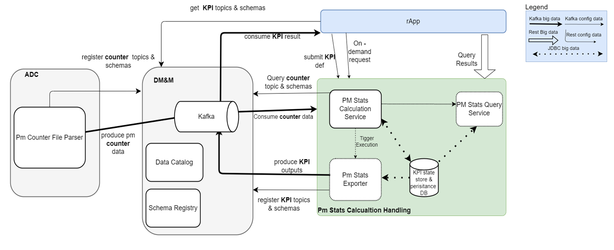
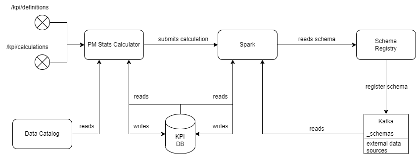
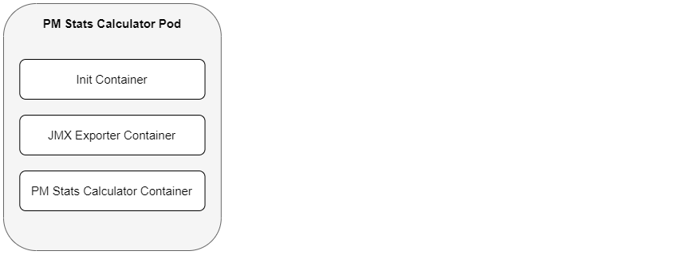

# PM Stats Calculator User Guide

- [PM Stats Calculator User Guide](#pm-stats-calculator-user-guide)
    - [Overview](#overview)
        - [Revision History](#revision-history)
        - [Architecture](#architecture)
        - [Deployment View](#deployment-view)
        - [Dimensioning and Characteristics](#dimensioning-and-characteristics)
    - [Deployment](#deployment)
        - [Deployment Prerequisites](#deployment-prerequisites)
        - [Deployment in a Kubernetes Environment Using Helm](#deployment-in-a-kubernetes-environment-using-helm)
        - [Configuration Parameters](#configuration-parameters)
        - [Service Dimensioning](#service-dimensioning)
        - [Hardening](#hardening)
        - [Upgrade Procedures](#upgrade-procedures)
    - [Privacy User Guidelines](#privacy-user-guidelines)
    - [Operation and Maintenance](#operation-and-maintenance)
      - [Performance Management](#performance-management)
        - [Metrics of the REST API](#metrics-of-the-rest-api)
        - [Metrics of the Scheduler component](#metrics-of-the-scheduler-component)
        - [Metrics of the Spark application](#metrics-of-the-spark-application)
    - [Troubleshooting](#troubleshooting)
        - [Prerequisites](#prerequisites)
        - [Installation](#installation)
        - [Health Checks](#health-checks)
        - [Data Collection](#data-collection)
        - [Bug Reporting and Additional Support](#bug-reporting-and-additional-support)
        - [Recovery Procedure](#recovery-procedure)
    - [References](#references)

## Overview

This document provides an overview of the **PM Stats Calculator** Service.
It gives a brief description of its main features and its interfaces.

The PM Stats Calculator is a microservice within the PM Stats
Calculation Handling app. It provides a calculation engine
that can process PM statistics from Kafka and create KPIs
defined through a Rest API. The service is not able to parse
and calculate KPIs based on raw events, but any statistics,
counter created from events can be feed into this service
for more complex calculation.

### Revision History

| Date       | Revision | Comment                        | Author  |
|------------|----------|--------------------------------|---------|
| 2023-02-03 | 1.0.0    | Initial Version                | ENEMKRI |
| 2023-03-27 | 1.1.0    | Adding Logshipper sidecar      | EGADNNA |
| 2023-03-31 | 1.2.0    | Spark restructure              | ENYIMAT |
| 2023-06-19 | 1.3.0    | Adding CRUD API documentation. | EAJTALE |
| 2024-01-17 | 1.4.0    | Adding information on metrics. | EHUCADA |
| 2024-02-13 | 1.5.0    | Dimension enrichment           | EPICESZ |
| 2024-05-17 | 1.6.0    | Remove logshipper sidecar      | EGADNNA |
| 2024-06-05 | 1.7.0    | Add brAgent storage limit      | EGADNNA |

### Architecture



Figure 1 - Architectural context of PM Stats Calculator



Figure 2 - Architecture view of PM Stats Calculator

The PM Stats Calculation Handling owns the KPI definition model,
and it provides an interface for the rApps to be able to create
KPI definitions according to the KPI definition model and submit
these KPI definitions via a dedicated REST endpoint to the PM Stats
Calculation Handling. This KPI definitions will be then persisted
and will be used to calculate KPIs. The core responsibility of the
PM Stats Calculation Handling is to calculate KPIs and calculating
KPIs is the main responsibility of the PM Stats Calculator itself.

The PM Stats Calculator calculates KPIs based on PM counter data
which is produced by PM Counter File Parser. PM Counter File
Parser is processing network files and producing output records
on Kafka. The schemas of the records are stored in Schema Registry.
The topic name for an Avro schema and the corresponding Kafka
server address are stored in Data Catalog. Since PM counters are
the input data therefor the input can be specified as a Kafka topic
and an Avro schema.

The PM Stats Calculator can use tabular parameters to enrich
calculations with external data (other than PM counter data).
Tabular parameters must be declared, and their value sent in REST requests.

When a calculation is triggered PM Stats Calculator will submit a
calculation for the Spark cluster which is running on the Kubernetes
cluster. The Spark cluster is going to read the schema from the
Schema Registry and with it the data will be decoded from Kafka.
The value of the Kafka topic is encoded in format of Avro and in
order to decode this binary data the schema should be obtained.
This schema is held by the Schema Registry, that is the place where
the schema can be downloaded in order to decode the data which is on
the Kafka topic. After the values are decoded, Spark is going to
create an in-memory relational database table and SQL expressions
in Spark can be executed on this table. So Spark is going to
take care on obtaining schema. And as it is mentioned earlier
PM Stats Calculator owns the KPI database which will hold all the
output results after a calculation is done. So the PM Stats
Calculator can read and write this database and Spark can do the
same as well, because once Spark finishes with a calculation it
should persist the data into the KPI database.

After kpis are calculated KPIs needed to be exposed. There are two
outputs to do. PM Stats Calculation Handling will produce a continuous
output stream of the calculated KPI results, and since these are Kafka
topics with some dedicated Avro schemas they have to be made available
in the DMM, and it is the responsibility of the PM Stats Calculation
Handling to perform this. And the other output is a REST-based
historical query option where the KPI results can be queried.

#### Application Programming Interfaces (APIs)

This chapter gives an overview of included APIs.

| API                                        | API Summary                                                    |
|--------------------------------------------|----------------------------------------------------------------|
| GET /calc/v1/calculations                  | Retrieve calculations started in the previous elapsed minutes  |
| POST /calc/v1/calculations                 | Submit a calculation request for validation and calculation    |
| GET /calc/v1/calculations/{calculation_id} | Retrieve the status of a KPI calculation                       |
| GET /model/v1/definitions                  | Retrieves the persisted KPI definitions from the database.     |
| POST /model/v1/definitions                 | Inserts new KPI definitions into the database.                 |
| PATCH /model/v1/definitions/{name}         | Updates the specified KPI definition in the database.          |
| DELETE /model/v1/definitions               | Deletes the list of KPI definitions from the database.         |
| GET /calculator-service/health             | Retrieve the health status of the service                      |

##### Deprecated APIs

The following APIs have been deprecated, and their use is not supported anymore.

| API                                        | API Summary                                                    |
|--------------------------------------------|----------------------------------------------------------------|
| PUT /model/v1/definitions                  | Add KPI Definition list to the database and submit simple KPIs |

### Deployment View

The PM Stats Calculator is packaged as a Docker container.
It supports deployment in Kubernetes using Helm.

Figure 3 below is the deployment view of the
PM Stats Calculator in the Kubernetes Cluster.



Figure 3 - Deployment view of PM Stats Calculator

To deploy the Service, refer to the [Deployment section](#deployment), which:

- explains how to get started using the PM Stats Calculator Service in the
supported environments.

- specifies configuration options for starting the PM Stats Calculator docker
container.

If problems occur when using the service, refer to the [Troubleshooting section](#troubleshooting).

### Dimensioning and Characteristics

#### Physical Dimensioning

| Microservices       | Memory Requested (MiB) | Memory Limit (MiB) | CPU requested (m) | CPU limit (m) |
|---------------------|------------------------|--------------------|-------------------|---------------|
| PM Stats Calculator | 6464                   | 7168               | 4500              | 5900          |

#### Scaling

| Scaling Supported (Yes/No) | Minimum number of instances | Maximum number of recommended instances |
|----------------------------|-----------------------------|-----------------------------------------|
| No                         | 1                           | 1                                       |

<!-- TODO
#### Resilience
<*Describe from a functional view how it is designed to support resilience. How
does the service achieve high availability*>
-->

#### Upgrade - In Service Software Upgrade

Due to current restriction on maximum number of replicas (see Scaling section),
during the upgrade phase functional continuity is not guaranteed.

## Deployment

This section describes the operational procedures for how to deploy and upgrade
the PM Stats Calculator Service in a Kubernetes environment with Helm. It also
covers hardening guidelines to consider when deploying this service.

### Deployment Prerequisites

-   A running Kubernetes environment with helm support, some
    knowledge of the Kubernetes environment, including the
    networking detail, and access rights to deploy and manage workloads.

-   Access rights to deploy and manage workloads.

-   Availability of the kubectl CLI tool with correct authentication
    details. Contact the Kubernetes System Admin if necessary.

-   Availability of the helm package.

-   Availability of Helm charts and Docker images for the service and
    all dependent services.s

### Deployment in a Kubernetes Environment Using Helm

This section describes how to deploy the service in Kubernetes using Helm and
the `kubectl` CLI client. Helm is a package manager for Kubernetes that
streamlines the installation and management of Kubernetes applications.

#### Preparation

Prepare helm chart and docker images. Helm chart in the following link
can be used for installation:

[Helm Chart Package](https://arm.seli.gic.ericsson.se/artifactory/proj-eric-oss-drop-helm/eric-oss-pm-stats-calculator/)

#### Pre-Deployment Checks for PM Stats Calculator

Ensure the following:

- The eric-oss-pm-stats-calculator is not used already in the
corresponding clusters' namespace. Use `helm list -n <namespace>`
command to list the existing deployments (and delete previous
deployment with the corresponding eric-oss-pm-stats-calculator if needed).

- The same namespace is used for all deployments.

- TLS is disabled for all deployments

- A secret which contains armdocker registry's login credentials is
already created in the namespace.

    ```text
    kubectl create secret docker-registry <SECRET_NAME> \
      --docker-username="${SELI_ARTIFACTORY_REPO_USER}" \
      --docker-password="${SELI_ARTIFACTORY_REPO_PASS}" \
      --docker-server=https://armdocker.rnd.ericsson.se/ \
      --namespace="${NAMESPACE}"
    ```

    The variables specified in the command are as follows:

  - `<SECRET_NAME>`: String value, the name of the secret.

  - `<SELI_ARTIFACTORY_REPO_USER>`: String value, your username for
  [https://armdocker.rnd.ericsson.se/](https://armdocker.rnd.ericsson.se/) .

  - `<SELI_ARTIFACTORY_REPO_PASS>`: String value, your API Key.
  (You can find this after you logged in to [https://armdocker.rnd.ericsson.se/](https://armdocker.rnd.ericsson.se/)
  Click on 'Welcome <your_username>', then click on 'Edit Profile'.
  Add your password again, and scroll down until the API Key section.)

  - `<NAMESPACE>`: String value, a name to be used dedicated by the user for
  deploying own helm charts.

#### Helm Chart Installations of Dependent Services

- Install Message Bus KF - Please refer to
[Message Bus KF's Service User Guide's Deployment Section][Kafka_User_Guide]

- Install Schema Registry - Please refer to
[Schema Registry's Service User Guide's Deployment Section][SR_User_Guide]

- Install Data Catalog - Please refer to
[Data Catalog's User Guide's Deployment Section][DC_User_Guide]

#### Helm Chart Installation of PM Stats Calculator Service

>**Note:** Ensure all dependent services are deployed and healthy before you
>continue with this step.

Helm is a tool that streamlines installing and managing Kubernetes
applications. PM Stats Calculator can be deployed on Kubernetes using
Helm Charts. Charts are packages of pre-configured Kubernetes resources.

Users can override the default values provided in the values.yaml template of
the helm chart. The recommended parameters to override are listed in the
following section: [Configuration Parameters](#configuration-parameters).

##### Deploy the PM Stats Calculator Service

Install the PM Stats Calculator on the Kubernetes cluster by using the
helm installation command:

```text
helm install <RELEASE_NAME> <CHART_REFERENCE> --namespace <NAMESPACE>
```

The variables specified in the command are as follows:

- `<RELEASE_NAME>`: String value, a name to identify and manage your helm chart.

- `<CHART_REFERENCE>`: A path to a packaged chart, a path to an unpacked chart
directory or a URL.

- `<NAMESPACE>`: String value, a name to be used dedicated by the user for
deploying own helm charts.

##### Verify the PM Stats Calculator Service Availability

To verify whether the deployment is successful, do as follows:*

*1.  Check if the chart is installed with the provided release name and
    in related namespace by using the following command:*

```text
$helm ls -a -n <NAMESPACE>
```

  *Chart status should be reported as "DEPLOYED".*

*2.  Verify the status of the deployed helm chart.*

```text
$helm status <RELEASE_NAME> -n <NAMESPACE>
```

  *Chart status should be reported as "DEPLOYED".*

*3.  Verify that the pods are running
    by getting the status for your pods.*

```text
$kubectl get pods -n <NAMESPACE>
```

  *For example:*

```text
$helm ls -n example
$helm status exampleRelease -n example
$kubectl get pods -n example
```

  *All pods status should be "Running" and number of Deployment Available
  should be the same as the replica count. All containers in any pod should
  be reported as "Ready".*

### Configuration Parameters

#### Mandatory Configuration Parameters

There are no mandatory parameters.

#### Optional Configuration Parameters

Following parameters are not mandatory. If not explicitly set
(using the --set argument), the default values provided
in the helm chart are used.

| Variable Name                                           | Description                                                                                                                                                                                                                                                                   | Default Value                               |
|---------------------------------------------------------|-------------------------------------------------------------------------------------------------------------------------------------------------------------------------------------------------------------------------------------------------------------------------------|---------------------------------------------|
| `blockScheduledWhenHandlingOnDemand`                    | Boolean value to block scheduled calculations when on demand is in progress                                                                                                                                                                                                   | `FALSE`                                     |
| `brAgent.storage.size`                                  | Ephemeral storage limit for the Backup and Restore Agent. If the backup size gets larger than this limit, then Kubernetes will evict the pod and the backup process will fail.                                                                                                | `1Gi`                                       |
| `dataCatalog.url`                                       | String value, URL of Data Catalog's endpoint                                                                                                                                                                                                                                  | `eric-oss-data-catalog`                     |
| `dataCatalog.port`                                      | Integer value, the port Data Catalog is listening on, the port number is valid between 0 and 65535                                                                                                                                                                            | `9590`                                      |
| `dst.collector.host`                                    | String value, sets the host for DST collector                                                                                                                                                                                                                                 | `http://eric-dst-collector`                 |
| `dst.collector.portJaegerGrpc`                          | Integer value, sets the port for Jaeger using GRPC                                                                                                                                                                                                                            | `14250`                                     |
| `dst.collector.portOtlpGrpc`                            | Integer value, sets the port for DST collector when using GRPC                                                                                                                                                                                                                | `4317`                                      |
| `dst.collector.portZipkinHttp`                          | Integer value, sets the port for Zipkin using HTTP                                                                                                                                                                                                                            | `9411`                                      |
| `dst.enabled`                                           | Boolean value, determines whether tracing is enabled or not                                                                                                                                                                                                                   | `TRUE`                                      |
| `dst.propagator.type`                                   | String value, sets the producer type for DST. Valid values are "B3" or "W3C" or "B3,W3C"                                                                                                                                                                                      | `b3`                                        |
| `groupingRules.aggregationElements`                     | Boolean value to set the type of grouping executions                                                                                                                                                                                                                          | `FALSE`                                     |
| `groupingRules.aggregationPeriod`                       | Boolean value to set the type of grouping executions                                                                                                                                                                                                                          | `FALSE`                                     |
| `groupingRules.inputSource`                             | Boolean value to set the type of grouping executions                                                                                                                                                                                                                          | `TRUE`                                      |
| `kafka.bucketSize`                                      | Integer value, maximum number of messages to be read once from Kafka                                                                                                                                                                                                          | `200`                                       |
| `kafka.hostname`                                        | String value, URL of Kafka's endpoint                                                                                                                                                                                                                                         | `eric-data-message-bus-kf`                  |
| `kafka.kpiExecutionReportTopic`                         | String value, name of the execution report topic                                                                                                                                                                                                                              | `pm-stats-calculator-json-execution-report` |
| `kafka.kpiExposureTopic`                                | String value, name of the exposure topic                                                                                                                                                                                                                                      | `pm-stats-calculator-json-exposure-control` |
| `kafka.port`                                            | Integer value, the port Kafka is listening on, the port number is valid between 0 and 65535                                                                                                                                                                                   | `9092`                                      |
| `kpiData.metricsUser`                                   | String value, name of the metrics user inside the postgres deployment                                                                                                                                                                                                         | `exporter`                                  |
| `kpiData.nameOverride`                                  | String value, name of the postgres deployment                                                                                                                                                                                                                                 | `eric-pm-kpi-data-v2`                       |
| `kpiData.postgresDatabase`                              | String value, name of the database inside the postgres deployment                                                                                                                                                                                                             | `kpi_service_db`                            |
| `kpiData.postgresUser`                                  | String value, name of the postgres user inside the postgres deployment                                                                                                                                                                                                        | `kpi_service_user`                          |
| `kpiData.replicaUser`                                   | String value, name of the replica user inside the postgres deployment                                                                                                                                                                                                         | `replica`                                   |
| `kpiData.service.port`                                  | Integer value, the port postgres is listening on, the port number is valid between 0 and 65535                                                                                                                                                                                | `5432`                                      |
| `kpiExecutionPeriod`                                    | String value, a CHRON expression to set the heartbeat of scheduled calculations                                                                                                                                                                                               | `0 0-53/7 \* \* \* ? \*`                    |
| `log.streamingMethod`                                   | String value, determines the log streaming method. The default value is determined by global.log.streamingMethod.                                                                                                                                                             | `""`                                        |
| `maxHeartbeatToWaitToRecalculateSimples`                | Integer value, the number of heartbeats before Simple execution groups are enforced to be calculated                                                                                                                                                                          | `5`                                         |
| `maximumConcurrentCalculations`                         | Integer value, the maximum number of concurrent calculations                                                                                                                                                                                                                  | `2`                                         |
| `maxNumberOfParallelOnDemandCalculations`               | Integer value, the maximum number of parallel on demand calculations                                                                                                                                                                                                          | `5`                                         |
| `podDisruptionBudget.minAvailable`                      | Integer value or percentage, the number of pods that must still be available after the eviction, only one of this or podDisruptionBudget.maxUnavailable can be in effect at a time. If both are set this takes precedence                                                     | `1`                                         |
| `podDisruptionBudget.maxUnavailable`                    | Integer value or percentage, the maximum number of pods that can be evicted, only one of this or podDisruptionBudget.minAvailable can be in effect at a time. If both are set podDisruptionBudget.minAvailable takes precedence                                               | `""`                                        |
| `probes.calculator.livenessProbe.failureThreshold`      | Integer value, after a probe fails failureThreshold times in a row, Kubernetes considers that the overall check has failed: the container is not ready / healthy / live.                                                                                                      | `5`                                         |
| `probes.calculator.livenessProbe.initialDelaySeconds`   | Integer value, number of seconds after the container has started before startup                                                                                                                                                                                               | `90`                                        |
| `probes.calculator.livenessProbe.periodSeconds`         | Integer value, how often (in seconds) to perform the probe                                                                                                                                                                                                                    | `30`                                        |
| `probes.calculator.livenessProbe.timeoutSeconds`        | Integer value, number of seconds after which the probe times out                                                                                                                                                                                                              | `5`                                         |
| `probes.calculator.readinessProbe`                      | Integer value, minimum consecutive successes for the probe to be considered successful after having failed                                                                                                                                                                    | `1`                                         |
| `probes.calculator.readinessProbe.failureThreshold`     | Integer value, after a probe fails failureThreshold times in a row, Kubernetes considers that the overall check has failed: the container is not ready / healthy / live.                                                                                                      | `5`                                         |
| `probes.calculator.readinessProbe.initialDelaySeconds`  | Integer value, number of seconds after the container has started before startup                                                                                                                                                                                               | `90`                                        |
| `probes.calculator.readinessProbe.periodSeconds`        | Integer value, how often (in seconds) to perform the probe                                                                                                                                                                                                                    | `30`                                        |
| `probes.calculator.readinessProbe.timeoutSeconds`       | Integer value, number of seconds after which the probe times out                                                                                                                                                                                                              | `5`                                         |
| `probes.jmxExporter.livenessProbe.failureThreshold`     | Integer value, after a probe fails failureThreshold times in a row, Kubernetes considers that the overall check has failed: the container is not ready / healthy / live.                                                                                                      | `5`                                         |
| `probes.jmxExporter.livenessProbe.initialDelaySeconds`  | Integer value, number of seconds after the container has started before startup                                                                                                                                                                                               | `0`                                         |
| `probes.jmxExporter.livenessProbe.periodSeconds`        | Integer value, how often (in seconds) to perform the probe                                                                                                                                                                                                                    | `10`                                        |
| `probes.jmxExporter.livenessProbe.timeoutSeconds`       | Integer value, number of seconds after which the probe times out                                                                                                                                                                                                              | `1`                                         |
| `probes.jmxExporter.readinessProbe`                     | Integer value, minimum consecutive successes for the probe to be considered successful after having failed                                                                                                                                                                    | `1`                                         |
| `probes.jmxExporter.readinessProbe.failureThreshold`    | Integer value, after a probe fails failureThreshold times in a row, Kubernetes considers that the overall check has failed: the container is not ready / healthy / live.                                                                                                      | `5`                                         |
| `probes.jmxExporter.readinessProbe.initialDelaySeconds` | Integer value, number of seconds after the container has started before startup                                                                                                                                                                                               | `0`                                         |
| `probes.jmxExporter.readinessProbe.periodSeconds`       | Integer value, how often (in seconds) to perform the probe                                                                                                                                                                                                                    | `10`                                        |
| `probes.jmxExporter.readinessProbe.timeoutSeconds`      | Integer value, number of seconds after which the probe times out                                                                                                                                                                                                              | `1`                                         |
| `prometheus.path`                                       | String value, URL of Prometheus  metrics' endpoint                                                                                                                                                                                                                            | `/metrics`                                  |
| `prometheus.scrape`                                     |                                                                                                                                                                                                                                                                               | `true`                                      |
| `prometheus.url`                                        | Integer value, the port Prometheus metrics is listening on, the port number is valid between 0 and 65535                                                                                                                                                                      | `21002`                                     |
| `queueWeight.onDemandCalculation`                       | Integer value, the maximum number of consecutive on demand calculations                                                                                                                                                                                                       | `3`                                         |
| `queueWeight.scheduledCalculation`                      | Integer value, the maximum number of consecutive simple calculations                                                                                                                                                                                                          | `1`                                         |
| `replicaCount`                                          | Integer value, count of replicas in the statefulset                                                                                                                                                                                                                           | `1`                                         |
| `saveEventLogs`                                         | Boolean value, if set to `true` will generate the spark event logs under /tmp/spark-events                                                                                                                                                                                    | `false`                                     |
| `schemaRegistry.port`                                   | Integer value, the port Schema Registry is listening on, the port number is valid between 0 and 65535                                                                                                                                                                         | `8081`                                      |
| `schemaRegistry.url`                                    | String value, URL of Schema Registry's endpoint                                                                                                                                                                                                                               | `eric-oss-schema-registry-sr`               |
| `spark.driver.memory`                                   | Amount of memory to use for the driver process, i.e. where SparkContext is initialized, in the same format as JVM memory strings with a size unit suffix ("k", "m", "g" or "t") (e.g. 512m, 2g). [Spark Configuration][Apache_Spark_Configuration]                            | `1g`                                        |
| `spark.executor.cores`                                  | The number of cores to use on each executor for Scheduled Simple and Scheduled Complex calculations. [Spark Configuration][Apache_Spark_Configuration]                                                                                                                        | `2`                                         |
| `spark.executor.memory`                                 | Amount of memory to use per executor process for Scheduled Simple and Scheduled Complex calculations, in the same format as JVM memory strings with a size unit suffix ("k", "m", "g" or "t") (e.g. 512m, 2g). [Spark Configuration][Apache_Spark_Configuration]              | `4g`                                        |
| `spark.executor.onDemand.cores`                         | The number of cores to use on each executor for On Demand calculations. Maps to `spark.executor.cores` property. [Spark Configuration][Apache_Spark_Configuration]                                                                                                            | `2`                                         |
| `spark.executor.onDemand.memory`                        | Amount of memory to use per executor process for On Demand calculations, in the same format as JVM memory strings with a size unit suffix ("k", "m", "g" or "t") (e.g. 512m, 2g). Maps to `spark.executor.memory` property. [Spark Configuration][Apache_Spark_Configuration] | `4g`                                        |
| `spark.hostname`                                        | Together with `spark.port` property comprise the `spark.master` property, which ultimately determines the cluster manager to connect to. [Spark Configuration][Apache_Spark_Configuration]                                                                                    | `eric-pm-kpi-spark-cluster`                 |
| `spark.indexedNumericPartitionColumns`                  | The name of the column the underlying [DataSet](https://spark.apache.org/docs/3.2.1/api/java/index.html?org/apache/spark/sql/Dataset.html) is partitioned on.                                                                                                                 | `""`                                        |
| `spark.jmxExecutor.overrideExecutorPort`                | Boolean value, if `true`, sets the `com.sun.management.jmxremote.port` and `com.sun.management.jmxremote.rmi.port` value for the spark executor's JVM to `0`.                                                                                                                 | `false`                                     |
| `spark.jmxExecutor.startingPort`                        | Integer value, sets the first port number to be used by a JMX Executor instance in a given Spark Executor. The total range of used JMX Executor ports can be determined by adding `maximumConcurrentCalculations` to `spark.jmxExecutor.startingPort`                         | `10010`                                     |
| `spark.logLevel`                                        | String value, the log level to be used for Spark Executor and Driver logs. Accepted values are `DEBUG`, `INFO` and `ERROR`                                                                                                                                                    | `INFO`                                      |
| `spark.max.cores`                                       | Integer value, the maximum amount of CPU cores to request for the application from across the cluster (not from each machine). Maps to `spark.cores.max` property. [Spark Configuration][Apache_Spark_Configuration]                                                          | `2`                                         |
| `spark.parallelism`                                     | Integer value, sets `spark.default.parallelism` and `spark.sql.shuffle.partitions` spark properties. [Spark Configuration][Apache_Spark_Configuration]                                                                                                                        | `2`                                         |
| `spark.partitionTableRead`                              | Boolean value, if `true`, it instructs spark to try to respect the table's partitioning scheme when loading it into a [DataSet](https://spark.apache.org/docs/3.2.1/api/java/index.html?org/apache/spark/sql/Dataset.html) for processing.                                    | `false`                                     |
| `spark.port`                                            | Together with `spark.hostname` property comprise the `spark.master` property, which ultimately determines the cluster manager to connect to. [Spark Configuration][Apache_Spark_Configuration]                                                                                | `7077`                                      |
| `spark.scheduler.maxRegisteredResourcesWaitingTime`     | Maximum amount of time to wait for resources to register before scheduling begins. [Spark Configuration][Apache_Spark_Configuration]                                                                                                                                          | `30s`                                       |
| `spark.scheduler.minRegisteredResourcesRatio`           | The minimum ratio of registered resources (registered resources / total expected resources) to wait for before scheduling begins. Specified as a double between 0.0 and 1.0. [Spark Configuration][Apache_Spark_Configuration]                                                | `0.0`                                       |
| `terminationGracePeriodSeconds`                         | Integer value, termination grace period in seconds                                                                                                                                                                                                                            | `30`                                        |

### Service Dimensioning

The service provides by default resource request values and resource limit
values as part of the Helm chart. These values correspond to a default size for
deployment of an instance. This chapter gives guidance in how to do service
dimensioning and how to change the default values when needed.

#### Override Default Dimensioning Configuration

If other values than the default resource request and default resource limit
values are preferred, they must be overridden at deployment time.

Here is an example of the `helm install` command where resource requests and
resource limits are set:

```text
helm install calculator eric-oss-pm-stats-calculator-1.0.0-999.tgz --set resources.calculator.requests.cpu=2000m
```

#### Use Minimum Configuration per Service Instance

This chapter specifies the minimum recommended configuration per service
instance.

| Resource Type (Kubernetes Service)        | Resource Request Memory (MiB) | Resource Limit Memory (MiB) | Resource Request CPU (m) | Resource Limit CPU (m) |
|-------------------------------------------|-------------------------------|-----------------------------|--------------------------|------------------------|
| eric-oss-pm-stats-calculator-data-init    | 64                            | 256                         | 50                       | 200                    |
| eric-oss-pm-stats-calculator              | 4096                          | 4096                        | 2500                     | 3000                   |
| eric-oss-pm-stats-calculator-jmx-exporter | 128                           | 512                         | 100                      | 500                    |

To use minimum configuration, override the default values for resource requests
and resource limits in the helm chart at deployment time.

#### Use Maximum (Default) Configuration per Service Instance

The maximum recommended configuration per instance is provided as default in the
Helm chart. Both Resource Request values and Resource Limit values are included
in the helm charts.

### Hardening

The PM Stats Calculator service comes pre-hardened, so there are no additional
hardening activities to be done after the deployment.

### Upgrade Procedures

>**Note:** If any chart value is customized at upgrade time through the
>"--set" option of the "helm upgrade" command, all other previously customized
>values will be replaced with the ones included in the new version of the chart.
>To make sure that any customized values are carried forward as part of the
>upgrade, consider keeping a versioned list of such values. That list could be
>provided as input to the upgrade command in order to be able to use the "--set"
>option without side effects.

```text
helm upgrade <RELEASE_NAME> <CHART_REFERENCE> --reuse-values --namespace <NAMESPACE> [--set <OTHER_PARAMETERS>]
```

<!-- TODO
## Security Guidelines

<*For Security Guidelines details,refer to the Security and
Privacy Guide section [here] (Privacy_Guide)*>

### Operative Tasks

<*Describe the operative tasks that are valid for this service (if
applicable).*>

<*If not applicable, state "This service does not include any
operative tasks."*>

<*Service Ports*><br/>
<*Following tables are generated from [Service Port JSON fragment]
(Service Port JSON fragment link to add)*
*by means of [service-ports tool] (service-ports tool link to add)*>

### Certificates

<*This section is mandatory. If no certificates are used by the product,
write “No certificates are used.” and remove the remaining rows.*>

<*For services (other than SIP-TLS) that are only using certificates
for System-Internal TLS-Based communication,
write "Service uses certificates for System-Internal
TLS-Based Communication. No other certificates are used.".
Remove the remaining rows.*>

<*List the names of all the certificates that can be used by the service
and for which detailed information are provided in form of
[CPI topic](CPI_topic_link_to_add). Report only the certificate names
in the following list. Certificates for System-Internal TLS-Based
communication shall be listed only by SIP-TLS service.*>

The following certificates can be used by the service and CPI topics are
provided for them:

- Certificate <*Certificate Name 1*>

- Certificate <*Certificate Name 2*>

- ...

### Security Events That Can Be Logged

<*This section is mandatory. If no security events are logged by the product,
write “No security events logged by the service.” and remove the remaining
rows.*>

<*List the security events for which logging is supported by the product, e.g.*

- *Start-up and shut-down of logging functions*

- *All authentication and login attempts and their results*

- *...*> -->

## Privacy User Guidelines

The service does not collect, store or process personal data on its own, PTI==0

## Operation and Maintenance

### Performance Management

The following section lists the description of all metrics that are implemented at application level.

#### Metrics of the REST API

| Metric name                                                                       | Metric type | Description                                                                  |
|-----------------------------------------------------------------------------------|-------------|------------------------------------------------------------------------------|
| pm_stats_calculator_api_definition_persisted_kpi_count                            | Counter     | Number of persisted KPIs (received via POST endpoint)                        |
| pm_stats_calculator_api_calculation_post_tabular_param_format_json_count          | Counter     | Number of calculation requests with tabular parameters in the format of JSON |
| pm_stats_calculator_api_calculation_post_tabular_param_format_csv_count           | Counter     | Number of calculation requests with tabular parameters in the format of CSV  |
| pm_stats_calculator_api_calculation_post_with_tabular_param_count                 | Counter     | Number of calculation requests with tabular parameters                       |
| pm_stats_calculator_api_calculation_post_compressed_payload_size_in_bytes_value   | Gauge       | Size of a compressed payload in bytes                                        |
| pm_stats_calculator_api_calculation_post_decompressed_payload_size_in_bytes_value | Gauge       | Size of a decompressed payload in bytes                                      |
| pm_stats_calculator_api_definition_post_endpoint_duration_ms                      | Timer       | Duration of the POST request processing (ms)                                 |
| pm_stats_calculator_api_definition_delete_endpoint_duration_ms                    | Timer       | Duration of the DELETE request processing (ms)                               |
| pm_stats_calculator_api_definition_patch_endpoint_duration_ms                     | Timer       | Duration of the PATCH request processing (ms)                                |
| pm_stats_calculator_api_definition_get_endpoint_duration_ms                       | Timer       | Duration of the GET request processing (ms)                                  |

For all timer metrics the count and statistical distribution of values are also exposed.
The followings are measured:

| Metric type        | Metric name <br/>(example for pm_stats_calculator_api_definition_post_endpoint_duration_ms) |
|--------------------|---------------------------------------------------------------------------------------------|
| Count              | pm_stats_calculator_api_definition_post_endpoint_duration_ms_count                          |
| 1 minute rate      | pm_stats_calculator_api_definition_post_endpoint_duration_ms_oneminuterate                  |
| 5 minute rate      | pm_stats_calculator_api_definition_post_endpoint_duration_ms_fiveminuterate                 |
| 15 minute rate     | pm_stats_calculator_api_definition_post_endpoint_duration_ms_fifteenminuterate              |
| 50th percentile    | pm_stats_calculator_api_definition_post_endpoint_duration_ms_50thpercentile                 |
| 75th percentile    | pm_stats_calculator_api_definition_post_endpoint_duration_ms_75thpercentile                 |
| 95th percentile    | pm_stats_calculator_api_definition_post_endpoint_duration_ms_95thpercentile                 |
| 98th percentile    | pm_stats_calculator_api_definition_post_endpoint_duration_ms_98thpercentile                 |
| 99th percentile    | pm_stats_calculator_api_definition_post_endpoint_duration_ms_99thpercentile                 |
| 999th percentile   | pm_stats_calculator_api_definition_post_endpoint_duration_ms_999thpercentile                |
| maximum            | pm_stats_calculator_api_definition_post_endpoint_duration_ms_max                            |
| minimum            | pm_stats_calculator_api_definition_post_endpoint_duration_ms_min                            |
| mean               | pm_stats_calculator_api_definition_post_endpoint_duration_ms_mean                           |
| meanrate           | pm_stats_calculator_api_definition_post_endpoint_duration_ms_meanrate                       |
| standard deviation | pm_stats_calculator_api_definition_post_endpoint_duration_ms_stddev                         |

NOTE: REST Api metrics are available after the related endpoint has been already invoked at the first time.

#### Metrics of the Scheduler component

| Metric name                                                                             | Metric type | Description                                               |
|-----------------------------------------------------------------------------------------|-------------|-----------------------------------------------------------|
| pm_stats_calculator_scheduler_current_on_demand_calculation_count                       | Counter     | Number of executed on-demand calculations                 |
| pm_stats_calculator_scheduler_on_demand_calculation_queue_count                         | Counter     | Number of jobs in the on-demand calculation queue         |
| pm_stats_calculator_scheduler_on_demand_calculation_queue_remaining_weight_count        | Counter     | Number of remaining weight in the on-demand queue         |
| pm_stats_calculator_scheduler_scheduled_simple_calculation_queue_count                  | Counter     | Number of jobs in the scheduled simple calculation queue  |
| pm_stats_calculator_scheduler_scheduled_complex_calculation_queue_count                 | Counter     | Number of jobs in the scheduled complex calculation queue |
| pm_stats_calculator_scheduler_scheduled_simple_calculation_queue_remaining_weight_count | Counter     | Number of remaining weight in the scheduled simple queue  |
| pm_stats_calculator_scheduler_ongoing_calculations_count                                | Gauge       | Number of ongoing calculations                            |
| pm_stats_calculator_scheduler_persisted_calculation_results_number                      | Gauge       | Number of all calculated KPIs                             |
| pm_stats_calculator_scheduler_persisted_calculations_count                              | Gauge       | Number of calculations by calculation state               |

#### Metrics of the Spark application

PM Stats Calculator exposes metrics for the calculations.

The following information is exposed:

- start time (UNIX epoch time),
- end time (UNIX epoch time),
- duration in milliseconds.

The metrics are named using the following format:

```
pm_stats_calculator_spark_<EXECUTION_GROUP>_<CALCULATION_ID>_<CALC_STATUS>_<METRIC_INFORMATION>`
```

The variables specified in the name are as follows:

- `<EXECUTION_GROUP>`: execution group of the calculation
- `<CALCULATION_ID>`: calculation ID in UUID format
- `<CALC_STATUS`: the status of the calculation (`finalizing`, `failed`, `nothing_calculated`). This value is empty in case of start time metrics.
- `<METRIC_INFORMATION>`:
  - calculation start time in number format: `calculation_start_time_number`
  - calculation start time in value format: `calculation_start_time_value`
  - calculation end time in number format: `calculation_end_time_number`
  - calculation end time in value format: `calculation_end_time_value`
  - calculation duration in number format: `calculation_duration_number`
  - calculation duration in value format: `calculation_duration_value`.

Examples:

- `pm_stats_calculator_spark_limited_complex_64b7849a_f288_4047_9784_df8da2920105_calculation_start_time_number`
- `pm_stats_calculator_spark_limited_complex_64b7849a_f288_4047_9784_df8da2920105_finalizing_calculation_duration_number`

Alternatively, for easier prometheus queries, the metrics are also exposed in the following format:

```
pm_stats_calculator_spark_<METRIC_INFORMATION>
```

The remaining variables are exposed as labels, here is the mapping:

```
<EXECUTION_GROUP>: execution_group
<CALCULATION_ID>: calculation_id
<CALC_STATUS>: calculation_status
```
Examples:

```
Metric:
pm_stats_calculator_spark_calculation_start_time_number

Labels:
execution_group: limited_complex
calculation_id: 64b7849a-f288-4047-9784-df8da2920105
calculation_status:
```

```
Metric:
pm_stats_calculator_spark_calculation_duration_number

Labels:
execution_group: limited_complex
calculation_id: 64b7849a-f288-4047-9784-df8da2920105
calculation_status: finalizing
```

NOTE: The metrics are available after the calculation has been already started.

### Backup and Restore

<*If Backup and Restore is not supported by the service, state the following:*>
The service does not support any kind of backup and restore operation.

<*If the service supports Backup and Restore functionality, describe in this
section the service specific operations needed to perform to execute
backup and restore tasks (if any). In any case, refer to the relevant
Backup and Restore Orchestrator Service instruction,
for the general instructions on backup and restore*>
-->

## Troubleshooting

This section describes the troubleshooting functions and procedures for
the PM Stats Calculator. It provides the
following information:

-   Simple verification and possible recovery.

-   The required information when reporting a bug or writing a support case,
    including all files and system logs that are needed.

-   How to retrieve the above information from the system.

### Prerequisites

-   `kubectl` CLI tool properly configured

### Installation

In case of a failed installation, the following steps are suggested:

1. Collect Pm Stats Calculator pod data for analysis (see [Data Collection](#data-collection))
2. Uninstall a release

    ```text
    helm uninstall <RELEASE_NAME> --namespace <NAMESPACE>
    ```

   - `<RELEASE_NAME>`: String value, a name to identify and manage your helm chart.

   - `<NAMESPACE>`: String value, a name to be used dedicated
by the user for deploying own helm charts.

3. List kubernetes resources

    ```text
    kubectl get all --namespace <NAMESPACE>
    ```

4. Delete resources that are not needed

    ```text
    kubectl delete <RESOURCE_NAME>
    ```

5. Reinstall

    ```text
    helm install <RELEASE_NAME> <CHART_REFERENCE> --namespace <NAMESPACE>
    ```

### Health Checks

Please refer to "Verify the PM Stats Calculator Service Availability" section
in the Deployment chapter of this document.
<!--
TODO - IDUN-53277
### Log Categories

Log Categories are used to support automatic filtering which enable a
possibility to support AI and machine learning. In the table below the log
categories provided by the service are listed.

| Category Name     | Security Log | Description              |
| ----------------- | -------------| ------------------------ |
| <*category_name*> | <*yes_no*>   | <*category_description*> |
| ... | ... | ... |

<*Instructions:   The Category Name must follow the [Log General Design
Rules](https://confluence.lmera.ericsson.se/display/AA/LOG+General+Design+Rules)
and therefore include the short name of the functional area and nature of the
logs in the category. The Functional Area short name to be used are the
Functional Area Acronyms listed in the [ADP FA
Invetory](https://confluence.lmera.ericsson.se/display/AA/FA+Inventory). Each
microservices log categories includes The combination of the FA short name and
the nature of the log category shall be separated by dash.   Example of category
names: IAM-token-generation, KM-genkey-issuecert.*>
-->

### Data Collection

- Get the name of all pods:

    ```text
    kubectl get pods -n <NAMESPACE>
    ```

- Collect logs from a pod:

    ```text
    kubectl logs <POD_NAME> -n <NAMESPACE> > <LOG_FILE>
    ```

- Collect logs from a specific container of a pod and save it into a file:

    ```text
    kubectl logs <POD_NAME> -n <NAMESPACE> -c <CONTAINER_NAME> > <LOG_FILE>
    ```

- Collect logs from eric-oss-pm-stats-calculator and save it into a file:

    ```text
    kubectl logs <POD_NAME> -n <NAMESPACE> -c <CONTAINER_NAME> > <LOG_FILE>
    ```

  An example:

  ```text
  kubectl logs eric-oss-pm-stats-calculator-6d68775d7c-ct4kq -n test-namespace -c eric-oss-pm-stats-calculator > logs.txt
  ```

- The detailed information about the pod are collected using command:

    ```text
    kubectl describe pod <POD_NAME> -n <NAMESPACE>
    kubectl exec <POD_NAME> -c <CONTAINER_NAME> -n <NAMESPACE> env
    ```

### Bug Reporting and Additional Support

Issues can be handled in different ways, as listed below:

-   For questions, support or hot requesting, see
    Additional Support.

-   For reporting of faults, see Bug Reporting.

#### Additional Support

If there are PM Stats Calculator Service support issues, please assign a support
ticket to Team Velociraptors in [Jira](https://jira-oss.seli.wh.rnd.internal.ericsson.com/).

#### Bug Reporting

If there is a suspected fault, please assign a bug ticket to Team Velociraptors
in [Jira](https://jira-oss.seli.wh.rnd.internal.ericsson.com/).
The bug report must contain specific PM Stats Calculator Service information
and all applicable troubleshooting information highlighted in the
[Troubleshooting](#troubleshooting), and [Data Collection](#data-collection).
In the ticket please:

- Give a description about the issue

- Give a description of how to reproduce the issue

- Give the used version of the PM Stats Calculator

- Attach the collected logs of the relevant pods (See how to collect PM Stats
Calculator pod logs in [Data Collection](#data-collection)

- Please do not attach Jenkins Pipeline links, because execution history can
be lost. Please save the logs and attach to the ticket.

- Indicate if the suspected fault can be resolved by restarting the pod.

### Recovery Procedure

This section describes how to recover the service in case of malfunction.

#### Restarting the Pod

To restart the pod use the following command:

```text
kubectl delete pod <POD_NAME> -n <NAMESPACE>
```

Kubernetes will automatically create a new pod for the deployment.

<!--
### Known Issues

<*When applicable, this section shall list the most common problems that
can occur and the instructions to avoid them*>
-->

## References

[ADP Generic Services Support JIRA][jira]

[DC_User_Guide]: https://adp.ericsson.se/marketplace/data-catalog/documentation/development/additional-documents/user-guide#deployment
[jira]: https://eteamproject.internal.ericsson.com/projects/GSSUPP
[Kafka_User_Guide]: https://adp.ericsson.se/marketplace/message-bus-kf/documentation/latest/dpi/service-user-guide#deployment
[Privacy_Guide]: https://ericsson.sharepoint.com/sites/networksecurity_classic/ProdSec/default.aspx
[SR_User_Guide]: https://adp.ericsson.se/marketplace/schema-registry-sr/documentation/1.1.13/dpi/service-user-guide#deployment
[Apache_Spark_Configuration]: https://spark.apache.org/docs/3.2.1/configuration.html
