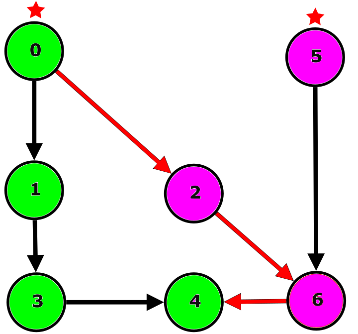
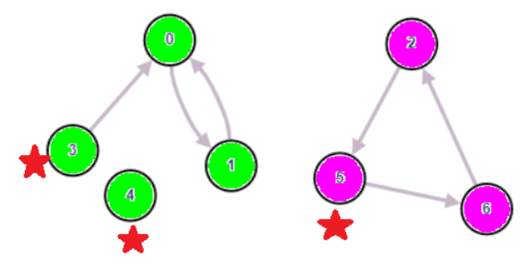
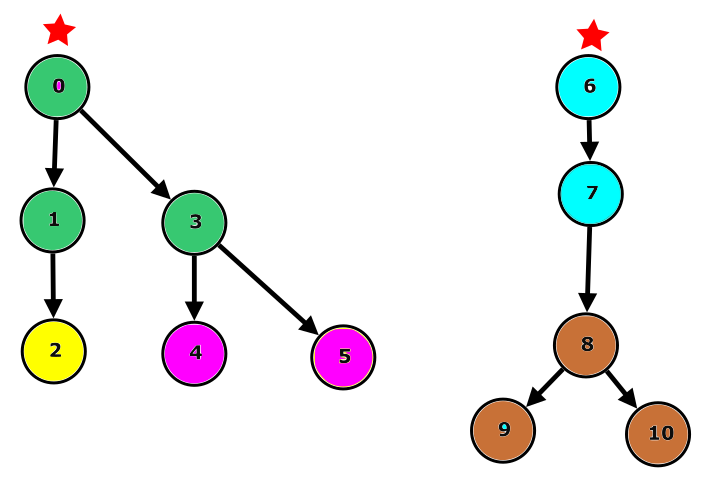

I put this file here for a reason, It's only a draft and I don't want the format checker to check this file just yet.
Once the splitting to the correct files happen this file can be deleted.

[//]: # (NOTE for the valid SDK: Component names must be eradicated from the document)

# General Overview

The KPI Calculation is responsible for calculating KPIs and exporting them to Kafka or expose them via the observability API.
It will read the source data from Kafka, makes calculations depending on the registered KPI definitions and sends a report of each calculation to the exporter via a Kafka message.
Said message will be processed and determined if anything can be exported (any table is reliably calculated).
The KPI tables are also exposed via REST so anyone with the correct permissions or knowledge can query the needed tables.

# PM Stats Calculator

For the Calculator to be able to calculate it needs registered KPI definitions (which should come from the rApps), and the source data on Kafka.

## KPI Types

KPI definition has 3 types:

- Scheduled Simple
- Scheduled Complex
- On Demand

The first two, as the name states, are calculated periodically, with a time interval that can be configured in the values.yaml
under `kpiExecutionPeriod`. The primary distinction is the _type_ of source data: PM counters for Simples, other KPIs for Complexes.
Simples are getting the data to calculate from Kafka, while the Complexes are getting it from the internal database.
On Demands can be calculated form other KPIs but will only be calculated right after a calculation triggered on the REST API.
Complexes and OnDemands must have Simple KPIs as its root source (indirectly all should depend on a simple)

## KPI output tables

Output tables are created from the KPI definitions. The table name will be `kpi_<alias>_<agg_period>` in case of defined aggregation period, and `kpi_<alias>`
in case of not defined. The table will contain all the KPIs as its own column, and the referenced aggregation elements will be the dimensions. The dimensions cannot
be null. In case of specified aggregation period, two more columns are added to the table, those are `aggregation_begin_time` and `aggregation_end_time`
this two columns will hold the time data for the calculated KPIs.

## KPI attributes
All type has Table and Definition level attributes which has different requirements by type.
Table level which has direct meaning for the creation of the output table, and is related to all the Definitions below it.

[//]: # (&#40;basic description for attributes needed?&#41;)

### Simple KPIs

#### Table attributes:
* aggregation_period: OPTIONAL
* alias: REQUIRED
* aggregation_elements: REQUIRED
* exportable: OPTIONAL
* inp_data_identifier: REQUIRED
* data_reliability_offset: OPTIONAL
* data_lookback_limit: OPTIONAL
* reexport_late_data: OPTIONAL

#### Definition attributes:
* name: REQUIRED
* expression: REQUIRED
* object_type: REQUIRED
* aggregation_type: REQUIRED
* aggregation_elements: OPTIONAL
* exportable: OPTIONAL
* filters: OPTIONAL
* data_reliability_offset: OPTIONAL
* data_lookback_limit": OPTIONAL
* reexport_late_data": OPTIONAL
* inp_data_identifier": OPTIONAL

### Complex KPIs

#### Table attributes:
* aggregation_period: OPTIONAL
* alias: REQUIRED
* aggregation_elements: REQUIRED
* exportable: OPTIONAL
* data_reliability_offset: OPTIONAL
* data_lookback_limit: OPTIONAL
* reexport_late_data: OPTIONAL

#### Definition attributes:

* name: REQUIRED
* expression: REQUIRED
* object_type: REQUIRED
* aggregation_type: REQUIRED
* execution_group: REQUIRED
* aggregation_elements: OPTIONAL
* exportable: OPTIONAL
* filters: OPTIONAL
* data_reliability_offset: OPTIONAL
* data_lookback_limit: OPTIONAL
* reexport_late_data: OPTIONAL

### On Demand KPIs

#### Table attributes:
* aggregation_period: REQUIRED
* alias: REQUIRED
* aggregation_elements: REQUIRED
* exportable: OPTIONAL

#### Definition attributes:

* name: REQUIRED
* expression: REQUIRED
* object_type: REQUIRED
* aggregation_type: REQUIRED
* aggregation_elements: OPTIONAL
* exportable: OPTIONAL
* filters: OPTIONAL

### Special Attributes

#### Aggregation type

The aggregation type will tell Spark how to aggregate the newly calculated date with the data in the database (is this even true? :D)
The aggregation type is an enum, so it can only be one of the following:
* SUM
* MAX
* ARRAY_INDEX_SUM
* PERCENTILE_INDEX_80 (more info about this in the UDF section)
* PERCENTILE_INDEX_90 (more info about this in the UDF section)
* FIRST

#### Object type

This attribute will be the type of the KPI in the database, so it has to be a postgreSQL type.
Its value is represented in an enum as well but due to character limitation it's validated against a regEx.
The regexes and the corresponding type:
* INTEGER[[0-9]+] -> defined sized integer array type
* INTEGER[] -> undefined sized integer array type
* INTEGER -> integer type
* FLOAT[[0-9]+] -> defined sized double precision array type
* FLOAT[] -> undefined sized double precision array type
* FLOAT -> double precision type
* LONG -> long type
* REAL -> real type
* BOOLEAN -> boolean type
* STRING -> string type (max 255 length)
* TEXT -> text type
* TIMESTAMP -> timestamp type

### Inheritance of attributes

There are several attributes which can be specified on table and definition level as well. If something is specified on table level that means it is
meant for all kpi definitions in the table as long as that same attribute is not specified in definition level. Therefore, all the table level attributes
are inherited to the definitions but are overwritten by the definition level attribute when specified.

### Default Values for attributes

Not all the attributes required to be filled, but if not filled some has a default value. Attributes with default values:
* EXPORTABLE = false
* REEXPORT_LATE_DATA = false
* AGGREGATION_PERIOD = undefined
* DATA_LOOK_BACK_LIMIT = 7_200 (minute)
* DATA_RELIABILITY_OFFSET = 15 (minute)

### PUT Validations of attributes:

All required attribute needs to be filled.

#### Aggregation period

Has to be one of the following: 15, 60, 1440. If not specified it will be handled internally as -1 which means it has no time dependency.
While it's optional for the scheduled KPIS, On Demand KPIs must have this attribute with a valid value.

#### Alias

While Scheduled KPIs can be in the same output table, On Demands must be in a separate table, therefore an On Demand cannot have the same alias-aggregation 
period combo with an already defined Scheduled one.
The alias itself is validated against the following regex: `^[a-z][a-z0-9_]{0,55}$` which means the alias must start with a lowercase alphabetical character, 
can contain numbers, lowercase alphabetical characters and underscore, and must be between 0-55 character.

#### Aggregation Elements

The attribute itself is a list which can not be empty, if not empty all element is validated to not be null or blank, and against a pattern to be in a
one of the following structure:
* `<table>.<column>`
* `<table>.<column> AS <column>`
* `'parameter' AS <column>`

#### Exportable

No validation. Either true or false.

#### Name

Needs to be globally unique, cant be null or blank, and validated against the following regex: `^[a-z][a-zA-Z0-9_]{0,55}$` which means the name must 
start with a lowercase alphabetical character, can contain numbers, lower- or uppercase alphabetical characters and underscore, and must be between 
0-55 character.

#### Expression

Must not be null or empty, for Simple KPIs could not contain "FROM", for the other two must only contain a single "FROM". ANSI SQL standard is supported.

#### Aggregation type

Must be one of the values that was previously mentioned.

#### Object Type

Must be in a format that one of the mentioned regexes matches.

#### Filters

If the filters attribute is not empty each filter is validated to not be null or blank, Scheduled KPIs filters cannot filter with parameter, and for 
all type it is validated to not have more than 1 datasource in it.

#### Data Reliability Offset

Only on Scheduled KPIs, value must be greater or equal to the aggregation period.

#### Data Lookback Limit

Only on Scheduled KPIs, value must be greater than 0.

#### Reexport Late Data

No validation. Either true or false. Only for Scheduled KPIs.

#### Execution Group

Only for Complex KPIs, value cannot be blank.

#### Input Data Identifier

Only for simple KPIs. Value must be in a format of `<dataSpace>|<category>|<schemaName>`

### PATCH Validation

#### Object Type
Think through and make a table with Bence's analysis once the PATCH is in place:
https://confluence-oss.seli.wh.rnd.internal.ericsson.com/pages/viewpage.action?pageId=524785493

## Other Validations for KPI Definition payload

[//]: # (Check Bence's validation file if all validation has been mentioned here. It should be under doc/Validation_Rules when merged)

### Empty check

When a KPI type is represented in the payload, at least one table needs to be specified for it. When a table is represented, at least one KPI must be in it.

### Data Identifier has Corresponding Entry in Data Catalog

The input data identifier is used to gather values on where the source data is located. For this reason the Data Catalog is store this information.
With a REST call for the Data Catalog's interface the MessageSchema can be obtained, which contains the Kafka Address and Topic name where the messages can be found,
and the namespace the schema is located in. The REST call is created with the values from the Input Data Identifier, and should only give back a single 
Kafka Address-Topic combo. This does not mean only a single Response will come back, only the gathered data should be the same.

### Execution Group Loops

[//]: # (Give an example for a valid graph)

The picture above shows an incorrect group dependency. The circles represent KPIs and the colors represent execution groups.
At the illustration the KPI 0 from the green execution group is depends on the KPI 2 from the pink execution group, which indirectly depends on the KPI 4
from the green execution group again. With this the order of calculations cannot be decided so the payload will be declined.

### KPI Definition Loops

[//]: # (Give an example for a valid graph)

Loops not detected only at execution group level but also on KPI Definition.

The picture above represents two execution groups: green and pink. For both execution groups loops are present.

~~~
For green:
0 -> 1 -> 0

For pink:
5 -> 2 -> 6 -> 5
~~~

### Schema Validation

In terms of Simple KPIs another check is made, that the reference schema indeed contains all the fields that used for the KPI to calculate.

## REST error codes for the KPI definition endpoint

* 201 Created - when everything goes right
* 400 Bad Request - If any of the validation fails which is not a conflict
* 409 Conflict - when the name uniqueness validation or the loop validation fails (why is the second a conflict exactly? should be bad request)
* 500 Internal Server error - When either the Data Catalog or Schema Registry is unreachable, or when any of the Database operation fails

## Tracking calculations

At the http://eric-pm-stats-calculator:8080/kpi-handling/calc/v1/calculations endpoint the calculation UUIDs from the last 60 minutes can be queried. 
The 60 minutes can be configured to be more or less with the `elapsedTime` query parameter.

With the needed calculation UUID more info can be gathered at the http://eric-pm-stats-calculator:8080/kpi-handling/calc/v1/calculations/{calculation_id}
endpoint. For each calculation, the type of the KPIs, the state of the calculation and if applicable the used Readiness Logs can be collected.

### Calculation states

#### Started

The `STARTED` state means the calculation is polled from the queue and th Spark environment is being started to calculate the KPIs.

#### In Progress

The `IN_PROGRESS` state means the Spark environment is ready and the KPIs are actively being calculated.

#### Finalizing

The `FINALIZING` state means the calculation was successful and an Execution Report is being created.

#### Finished

The `FINISHED` state is the state when the calculation and the execution report both were successful.

#### Failed

The `FAILED` state can be seen in the occasion when the spark calculation for some reason was unsuccessful

#### Nothing Calculated

The `NOTHING_CALCULATED` state is a special state and can only occur for scheduled calculations. This state means the execution group was scheduled 
to be calculated, but for Simple Calculations there was either no new messages on the kafka, or none of the messages which were on the Kafka was for 
that specific execution group. For Complex Calculations it can occur when the scheduling is happening at the exact time that execution group is calculated.
In that case the scheduler thinks there is uncalculated data for it, but when the Spark job starts it does not find any uncalculated data.

[//]: # (&#40;whats the right word for uncalculated?&#41;)

#### Lost

In case of a service failure and the restart of the pod, all the calculations which were calculated during the fail will be set to `LOST` state 

## Empty KPI Definition register payload

~~~json
{
  "on_demand": {
    "kpi_output_tables": [
      {
        "aggregation_period": "",
        "alias": "",
        "aggregation_elements": [],
        "exportable": "",
        "kpi_definitions": [
          {
            "name": "",
            "expression": "",
            "object_type": "",
            "aggregation_type": "",
            "aggregation_elements": [],
            "exportable": "",
            "filters": []
          }
        ]
      }
    ]
  },
  "scheduled_complex": {
    "kpi_output_tables": [
      {
        "aggregation_period": "",
        "alias": "",
        "aggregation_elements": [],
        "exportable": "",
        "data_reliability_offset": "",
        "data_lookback_limit": "",
        "reexport_late_data": "",
        "kpi_definitions": [
          {
            "name": "",
            "expression": "",
            "object_type": "",
            "aggregation_type": "",
            "aggregation_elements": [],
            "exportable": "",
            "filters": [],
            "data_reliability_offset": "",
            "data_lookback_limit": "",
            "reexport_late_data": "",
            "execution_group": ""
          }
        ]
      }
    ]
  },
  "scheduled_simple": {
    "kpi_output_tables": [
      {
        "aggregation_period": "",
        "alias": "",
        "aggregation_elements": [],
        "exportable": "",
        "inp_data_identifier": "",
        "data_reliability_offset": "",
        "data_lookback_limit": "",
        "reexport_late_data": "",
        "kpi_definitions": [
          {
            "name": "",
            "expression": "",
            "object_type": "",
            "aggregation_type": "",
            "aggregation_elements": [],
            "exportable": "",
            "filters": [],
            "data_reliability_offset": "",
            "data_lookback_limit": "",
            "reexport_late_data": "",
            "inp_data_identifier": ""
          }
        ]
      }
    ]
  }
}
~~~

## Execution Groups

The KPIs logically belonging together are grouped in an Execution group, which means these KPIs will be calculated in a single calculation.
The manner of grouping is different for each KPI type. For Complex KPIs, execution groups are defined explicitly in the KPI definition.
For On Demands, grouping is determined by the trigger request, KPIs which are triggered in the same request are calculated together in one execution
group, for the Simple KPIs there is an internal logic which also can be configured in the values.yaml:

~~~yaml
groupingRules:
  inputSource: true
  aggregationPeriod: false
  aggregationElements: false
~~~

Above the default values can be seen. Setting the `inputSource` flag to true at deployment time will group all Simple KPI definitions with identical
`inp_data_identifier` values into a single calculation. Setting only the `aggregationPeriod` to true will mean every Simple KPI with the same
aggregation period will be calculated together. Setting only the `aggregationElements` will result in calculating every Simple KPI which has the same
aggregation elements together. These flags are not exclusive, they can be mixed as preferred, resulting in all the rules applying to group the
KPIs together.

## Scheduler and heartbeat

At every heartbeat the scheduled calculations are queued to calculate. First all the Simple KPI groups are put into the queue, after that the Complex 
KPIs group dependency is determined, and ordered by that, but before those are put onto the queue another check is made to filter out any of the groups
which did not have at least one KPI which can be calculated reliably.

[//]: # (TODO: make a discussion about mentioning we can have 2 paralell calcs)
After all the groups are queued the calculations begin. Parallel 2 calculations can run (can be configured), but because of the possible dependencies 
on each other Complex KPI group calculations are done one-by-one.

Simple calculations take precedence before Complex calculations because of this if the next heartbeat came before all the scheduled calculations are 
done, the heartbeat is skipped if there are still Complex calculations are waiting in the queue. To not lose potential data for the Simple calculations 
due to the Kafka retention, the heartbeat is skipped maximum of 5 times (can be configured). If the limit is reached, the complex calculation queue is cleared, 
and the Simple calculations are triggered right away. At this heartbeat there will be no Complex calculation queued.

## KPI dependencies

The picture above demonstrates a KPI dependency graph. Each circle represents a KPI and each color represents an execution group. The arrows show dependency direction (0 depends on 1)
For better understanding lets say all the KPI in the picture is Complex KPI and any of the can depend on a Simple KPI, which are not represented in this picture.
With this information we can see there is 5 different execution group for the 10 KPI, there are inside dependencies and intergroup dependencies.

The dependencies inside a group will be solved during calculation time with an inside logic which will either stage them in a way the dependent KPIs 
will be calculated in different stages, or if any of them has a kpi_post_agg datasource will be guaranteed to be calculated after all the other KPIs 
had been calculated, and use the in memory data of the other KPIs instead of reading them out from the database.

The intergroup dependencies will be solved by the logic that was mentioned in the previous chapter. With the knowledge of the graph the queue will be 
filled programmatically in a way that all the dependencies of a group is before that group. Looking at the picture we can safely say the green group in this
queue will be after the yellow and the pink. Other than this requirement the other groups order is not defined.
For example Yellow->Pink->Green->Brown->Cyan and Yellow->Brown->Pink->Green->Cyan or any other combination where the dependencies are calculated before can happen.

## Reliabilities

Exporter will only export results which are _considered_ reliable. What to emphasize here:
-- The calculator goes with the assumption that once it has consumed a timestamp, the previous data is considered reliable. Once it there is enough source data for an aggperiod, it will export the KPIs for that period. The reliability offset can change this in both directions. (I think it would be a good practice to define something like the "triggering timestamp" - with a better name - and how it determines when an aggregation period is exported. And the offset between the aggperiod and the "triggering timestamp" is the reliability offset itself)
-- Even if a calculation was considered reliable, there is no guarantee that all the data is included in the calculation. Therefore, late data can occur. How is it handled - lookback limit, reexport late data
-- Thus, the reliability offset allows the rApp to configure whether they prefer to have the KPIs as soon as possible (0 or negative offsets) or decrease the possibility that any data is left out from the KPIs (positive offsets)
-- Only fully reliable rows are exported
-- Note that I used exported here because there is no difference between simples and complexes in this regard.

Query Service is a bit tricky, because soon after the LA, it will also only expose reliable results only - but not yet. We should think about how to explain this (rApp has to derive the reliability itself from the readiness log and the reliability offsets). But this can be quite complicated to explain and is only needed on the short term, so we should not overdo it. And I would not rule out yet completely to do the change in the QS before the LA, if time allows.

## Optimizing calculations

There are several way to optimize the calculations. Grouping KPIs which belongs together logically is one of them. If too much KPI is in the same group
the calculations can take a long time, instead try to group them together which needs to be together. Using in memory datasource (kpi:// and kpi_post_agg://)
instead of the kpi_db datasource can drastically help reducing the time needed since Spark will not need to read out the data form postgres but can utilize 
the data already in its cache.
While ANSI SQL standard can be used, it's strongly discouraged to use JOINs or similar expression due to its heavy load.

## UDFs, UDAFs

*insert description from Kodiak analysis*

## Retention

The default retention for the Calculator is 5 days, after that the data from the kpi calculation tables are pruned. Retention is also used to create 
the accurate number of partition tables. During table creation partition tables will be created for that day, for each day previous that today until 
the retention number, and two after today for buffer. At 1:00 AM every day a Cronjob drops all the partitions that are out of the retention period and 
deletes the data with it.

The number of the retention can be configured but must be between 1 and 30.

## SQL, Spark Functions

The standard ANSI SQL is supported, with the default Spark functions, and own UDF and UDAFs.
(maybe a list of the default spark functions? or at least the ones we expect)

# PM Stats Exporter

[//]: # (The Exporter related sections needs to be significantly condensed.)

Exporter is responsible to decide when a table is ready to be exported for the rApps. It consumes the Execution Reports sent by the Calculator, 
decides when a whole table is reliable, and writes the respective rows to Kafka for rApps to consume.

## Internal Status

[//]: # (&#40;needs better headline&#41;)

The Exporter keeps its own state in a compacted Kafka topic. After each processed message from the Calculator, the Exporter writes its status into Kafka.
If the pod for any reason stops, and needs restarting it will know exactly what of each table's status in regard to exporting when it starts up.

## Exporting data

After consuming an Execution Report message the Exporter checks if is there any new data that can be exported. KPIs without aggregation period is not exported.
An example Execution Report looks like this:

~~~json
{
  "execution_id": "0e79daa6-16f4-46f3-960d-91a6656e8f1b",
  "scheduled": true,
  "execution_start": 1675096080,
  "execution_end": 1675096150,
  "execution_group": "group",
  "tables": [
    {
      "name": "kpi_simple_60",
      "aggregation_period": 60,
      "kpis": [
        {
          "name": "kpi1",
          "reexport_late_data": false,
          "exportable": true,
          "reliability_threshold": 1674968400,
          "calculation_start_time": 1674961200
        },
        {
          "name": "kpi2",
          "reexport_late_data": false,
          "exportable": true,
          "reliability_threshold": 1674968400,
          "calculation_start_time": 1674961200
        }
      ],
      "list_of_kpis": [
        "kpi1",
        "kpi2"
      ],
      "list_of_dimensions": [
        "agg_element_0",
        "agg_element_1",
        "aggregation_begin_time",
        "aggregation_end_time"
      ]
    }
  ]
}
~~~

If the Report contains a scheduled calculation the Exporter updates its own state, and checks if the reliability threshold from the message for all the KPIs
in the table which are flagged as exportable has reached a new common value that wasn't exported before. In such case, not just the Internal Status will be written to a Kafka topic, but 
another internal topic will be filled with data of what can be exported. This topic is read by another consumer of the Exporter and will be responsible to
create the AVRO schema of the data, fill it with the desired values from the database, register the corresponding information into the Data Catalog
and send a Kafka message to the output topic for each database row.

The logic when we export is further influenced by the `reexport_late_data` flag. If the value is true, the Exporter will force to resend the data again from the
`calculation_start_time` until the previous or current new common reliability threshold. In this case duplicated data can happen in the output topics.
`reexport_late_data = true` means we export the whole row, not just that one KPI. Setting this value true will basically means setting it for the whole table. 

If the Report contains an On Demand calculation an export will be triggered right away from the lowest `calculation_start_time` to the highest `reliability_threshold`.
On Demand tables are not saved into the Internal memory and therefore into the compacted topic.

Each message contains a single row from the database. For example: if there is 50 rows in the database that can be exported, this will result in 50 message.

## Kafka messages

Duplicated data can happen in case of the need to reexport late data. By default, the output is written to a simple partition, if default value is changed, 
and messages are spread between partitions ordering is not guaranteed as the Exporter does not use partition-keys to write messages.

## Data Catalog

Data Catalog in general used to store information about MessageSchemas, therefore the Exporter is also registering data about the used AVRO schema, 
and output topics so the rApps can identify where is the data they need.

## Schema of messages

The used schema for the messages are a representation of the output table in the database. All KPIs flagged as exportable will be the part of the schema as a field
and all dimensions will be in it. The change in an output table will also mean the change in schemas. A table cannot have more dimension than the time of creation, but 
it can have more KPIs. Because of this, in the schema the KPIs are represented as an optional field, while the dimensions are required, with this the schema remains backward compatible
to changes in the KPIs.

[//]: # (&#40;The registering of the data and cache should be seriously reconsidered&#41;)

# PM Stats Query Service

no clue about this. These are needed for sure:
* Querying tables (metadata query)
* Supported OData operators
* Query limitations (performance, e.g. accepted filter size)
* query service /multiple pods - load balancer
* ephemeral cache

# Helm Values that can impact the flow

Under eric-oss-pm-stats-calculator key:
* kafka.bucketSize -> The maximum message the spark reads in a single calculation cycle
* queueWeight.scheduledCalculation / queueWeight.onDemandCalculation -> On Demand Calculations are prioritized over Scheduled calculations, 
to not block totally the scheduled calculations a weight can be specified which will ensure how many On Demand can be run before a Scheduled will be run
* kpiExecutionPeriod -> Controls when to trigger the heartbeat
* maximumConcurrentCalculations -> Controls how many calculation can run parallel
* maxNumberOfParallelOnDemandCalculations -> Controls how many On Demand calculation can be put into the queue before declining On Demand requests
* blockScheduledWhenHandlingOnDemand -> If true no scheduled can run until all On Demand is done
* maxHeartbeatToWaitToRecalculateSimples -> How many times a heartbeat can be skipped if there is still Complex Calculations in the queue until a force
eviction of Complex Calculations and immediate start of Simple Calculations
* groupingRules.inputSource -> If true the Simples with same input source will be calculated together
* groupingRules.aggregationPeriod -> If true the Simples with same aggregation period will be calculated together
* groupingRules.aggregationElements -> If true the Simples with same aggregation element will be calculated together
* retentionPeriod.days -> How long the data is stored

> Note: grouping rules are not mutually exclusive rules. They can be mixed and matched, but at least one needs to be true

# Complete Workflow

[//]: # (Revise the example schema and KPIs, if we should use more generic things, and maybe change the example schema from the Core Parser schema to the RAN parser schema)
An example schema:
~~~json
{
  "type": "record",
  "name": "example_schema1",
  "namespace": "5G.Core.PM_COUNTERS",
  "fields": [
    {
      "name": "dnPrefix",
      "type": [
        "null",
        "string"
      ],
      "doc": "DN prefix for the sending network node",
      "default": null
    },
    {
      "name": "nodeFDN",
      "type": "string",
      "doc": "Local DN of the sending network node"
    },
    {
      "name": "elementType",
      "type": [
        "null",
        "string"
      ],
      "doc": "Type of sending network node (e.g. PCC or PCG)",
      "default": null
    },
    {
      "name": "moFdn",
      "type": "string",
      "doc": "DN of the resource being measured"
    },
    {
      "name": "snssai",
      "type": [
        "null",
        "string"
      ],
      "doc": "Unique identifier of the 5G network slice",
      "default": null
    },
    {
      "name": "ropBeginTime",
      "type": "string",
      "doc": "Collection begin timestamp in UTC format"
    },
    {
      "name": "ropEndTime",
      "type": "string",
      "doc": "Collection end timestamp in UTC format"
    },
    {
      "name": "suspect",
      "type": [
        "null",
        "boolean"
      ],
      "doc": "Reliability flag for collected data. Default is false (reliable data).",
      "default": null
    },
    {
      "name": "apn",
      "type": [
        "null",
        "string"
      ],
      "doc": "Apn field",
      "default": null
    },
    {
      "name": "pmCounters",
      "type": [
        "null",
        {
          "type": "record",
          "name": "pmMetricsSchema",
          "fields": [
            {
              "name": "create_sm_context_resp_succ",
              "type": [
                "null",
                "int"
              ],
              "doc": "Number of created Session Modification Context responses successful",
              "default": null
            },
            {
              "name": "create_sm_context_req",
              "type": [
                "null",
                "int"
              ],
              "doc": "Number of created Session Modification Context requests",
              "default": null
            }
          ]
        }
      ],
      "default": null
    }
  ]
}
~~~

Example KPI definitions depending on the schema above:
~~~json
{
  "scheduled_complex": {
    "kpi_output_tables": [
      {
        "aggregation_period": 15,
        "alias": "complex_snssai_mofdn",
        "aggregation_elements": [
          "kpi_simple_snssai_mofdn_15.snssai",
          "kpi_simple_snssai_mofdn_15.moFdn"
        ],
        "data_reliability_offset": 0,
        "kpi_definitions": [
          {
            "name": "9315d4e6_b692_4abd_8c13_92740e3e7b36",
            "expression": "SUM(kpi_simple_snssai_mofdn_15.8c6832ad_e4a4_4eff_b710_880d6c32af4a) FROM kpi_db://kpi_simple_snssai_mofdn_15",
            "object_type": "FLOAT",
            "aggregation_type": "SUM",
            "exportable": true,
            "execution_group": "execution_group"
          },
          {
            "name": "d2b1a206_a16b_49f8_b09a_c04e331861fb",
            "expression": "SUM(kpi_simple_snssai_mofdn_15.5378a9f0_f8f1_4dba_834f_e2625054f5b4) / SUM(kpi_simple_snssai_mofdn_15.7776cfb8_d4b9_410b_8a00_adf6d47dd995) FROM kpi_db://kpi_simple_snssai_mofdn_15",
            "object_type": "FLOAT",
            "aggregation_type": "SUM",
            "exportable": true,
            "execution_group": "execution_group"
          },
          {
            "name": "a070e8b7_6f70_4793_afee_9ca67137aa6a",
            "expression": "SUM(kpi_simple_snssai_mofdn_15.ce13a91e_79df_40b7_a5a2_4deeb79a5449) FROM kpi_db://kpi_simple_snssai_mofdn_15",
            "object_type": "FLOAT",
            "aggregation_type": "SUM",
            "exportable": true,
            "execution_group": "execution_group"
          },
          {
            "name": "df1c4df2_1070_4b9e_b275_ecef856c360c",
            "expression": "SUM(kpi_simple_snssai_mofdn_15.8e555856_1773_40bc_ba56_672a62f3ce17) FROM kpi_db://kpi_simple_snssai_mofdn_15",
            "object_type": "FLOAT",
            "aggregation_type": "SUM",
            "exportable": true,
            "execution_group": "execution_group"
          }
        ]
      }
    ]
  },
  "scheduled_simple": {
    "kpi_output_tables": [
      {
        "aggregation_period": 15,
        "alias": "simple_snssai_mofdn",
        "aggregation_elements": [
          "example_schema1.snssai",
          "example_schema1.moFdn"
        ],
        "data_reliability_offset": 0,
        "inp_data_identifier": "5G|PM_COUNTERS|example_schema1",
        "kpi_definitions": [
          {
            "name": "8c6832ad_e4a4_4eff_b710_880d6c32af4a",
            "expression": "SUM(example_schema2.pmCounters.VS_NS_NbrRegisteredSub_5GS)",
            "object_type": "FLOAT",
            "aggregation_type": "SUM",
            "exportable": false,
            "inp_data_identifier": "5G|PM_COUNTERS|example_schema2",
            "aggregation_elements": [
              "example_schema2.snssai",
              "example_schema2.moFdn"
            ]
          },
          {
            "name": "5378a9f0_f8f1_4dba_834f_e2625054f5b4",
            "expression": "SUM(example_schema1.pmCounters.create_sm_context_resp_succ)",
            "object_type": "FLOAT",
            "aggregation_type": "SUM",
            "exportable": true
          },
          {
            "name": "7776cfb8_d4b9_410b_8a00_adf6d47dd995",
            "expression": "SUM(example_schema1.pmCounters.create_sm_context_req)",
            "object_type": "FLOAT",
            "aggregation_type": "SUM",
            "exportable": true
          },
          {
            "name": "ce13a91e_79df_40b7_a5a2_4deeb79a5449",
            "expression": "SUM(example_schema1.pmCounters.create_sm_context_resp_succ)",
            "object_type": "FLOAT",
            "aggregation_type": "SUM",
            "exportable": false
          },
          {
            "name": "8e555856_1773_40bc_ba56_672a62f3ce17",
            "expression": "MAX(example_schema1.pmCounters.create_sm_context_resp_succ)",
            "object_type": "FLOAT",
            "aggregation_type": "MAX",
            "exportable": false
          }
        ]
      }
    ]
  }
}
~~~

In the example there is two table, one for Simple KPIs and one for Complex KPIs. All but one Simple KPI is dependent on the example schema. 
The example KPI definition schema shows there is a possibility for an output table to contain KPIs dependent of distinct schemas, but in that case at KPI level 
the `inp_data_identifier` and the `aggregation_elements` has to be specified, and for the latter the names must match the table level one, or if not has to be renamed to the same.
In the example the table level aggregation element: `example_schema1.snssai` has the same name `snssai` as the KPI with different source
`example_schema2.snssai`. In case it wouldn't, rename could work as well such as: `example_schema2.snssai1 AS snssai`.

After registering the KPI definitions via REST into the Calculator, the Calculator gathers the needed data (Kafka address, topic, namespace) from the Data Catalog for 
both inp_data_identifier. At the next heartbeat with only the `inputSource` grouping rule turned on there will be 2 Simple Calculation scheduled. 
One for `5G|PM_COUNTERS|example_schema1` and one for `5G|PM_COUNTERS|example_schema2`.

Assuming only the first will have data on the topic and for the other there will be no messages yet, the first will be in the `FINALIZING` state
and later on `FINISHED` state, the other will be in `NOTHING_CALCULATED` state, as there were no data for that.

The first will be sending a report like this to the Exporter:

~~~json
{
  "execution_id": "0e79daa6-16f4-46f3-960d-91a6656e8f1b",
  "scheduled": true,
  "execution_start": 1675096080,
  "execution_end": 1675096150,
  "execution_group": "5G|PM_COUNTERS|example_schema1",
  "tables": [
    {
      "name": "kpi_simple_snssai_mofdn_15",
      "aggregation_period": 15,
      "kpis": [
        {
          "name": "5378a9f0_f8f1_4dba_834f_e2625054f5b4",
          "reexport_late_data": false,
          "exportable": true,
          "reliability_threshold": 1674968400,
          "calculation_start_time": 1674961200
        },
        {
          "name": "7776cfb8_d4b9_410b_8a00_adf6d47dd995",
          "reexport_late_data": false,
          "exportable": true,
          "reliability_threshold": 1674968400,
          "calculation_start_time": 1674961200
        },
        {
          "name": "ce13a91e_79df_40b7_a5a2_4deeb79a5449",
          "reexport_late_data": false,
          "exportable": false,
          "reliability_threshold": 1674968400,
          "calculation_start_time": 1674961200
        },
        {
          "name": "8e555856_1773_40bc_ba56_672a62f3ce17",
          "reexport_late_data": false,
          "exportable": false,
          "reliability_threshold": 1674968400,
          "calculation_start_time": 1674961200
        }
      ],
      "list_of_kpis": [
        "8c6832ad_e4a4_4eff_b710_880d6c32af4a",
        "5378a9f0_f8f1_4dba_834f_e2625054f5b4",
        "7776cfb8_d4b9_410b_8a00_adf6d47dd995",
        "ce13a91e_79df_40b7_a5a2_4deeb79a5449",
        "8e555856_1773_40bc_ba56_672a62f3ce17"
      ],
      "list_of_dimensions": [
        "snssai",
        "moFdn",
        "aggregation_begin_time",
        "aggregation_end_time"
      ]
    }
  ]
}
~~~

The Exporter will process this message. Since in the table there is only two KPI that is marked exportable only those two is considered when determined if there is enough 
new data arrived for this table to export anything. If the check determines there is anything that can be exported, another internal message is made onto a Kafka topic
which is again processed by the Exporter, which will fill out the Data Catalog for related information and write the data to the Kafka topic for rApps to consume.

At the next heartbeat if there is at least one Complex KPI can be calculated reliably the defined `execution_group` will be scheduled too, calculated and an Execution Report generated.
Since there is no KPI definition with `reexport_late_data` set to true, none of the rows will be reexported by the Exporter in case of late data is received.

# Was in the preDraft but no clue what to write:
* Schema evolution of PMSCH, tables, how it translates to QS & exporter interfaces

# Probably not even needed in the SDK but in the CPI?
* Internal architecture (be able to understand logs from various pods)
* Logging (content, what to pay attention to + runtime log level setting? References to central solution?)
* Custom runtime log-level setting?